# 🔄 Data Flow Architecture & Specifications (DFD) — Explooro Ecosystem (`DFD.md`)

> **Document Version:** 2.0 (Comprehensive — All 20 Subsystems Covered)  
> **Target System:** Explooro Multi-Tier Social Commerce & Digital Reseller Partnership Platform  
> **Authoring AI Pair:** Google Antigravity + Claude Code  
> **Coverage:** Level 0 (Context), Level 1 (20 Macro Subsystems), Level 2 (17 Detailed Micro-Flows), Data Dictionary & Event Pipelines.

---

## 1. Executive Summary & DFD Conventions

This document provides the exhaustive **Data Flow Diagrams (DFDs)** and architectural specifications for the **Explooro** platform. It details how data enters, transitions across services, interacts with ACID datastores, triggers real-time events, and flows out to external entities (Couriers, MFS Payment Gateways, SMS Providers, and Platform Users).

### 🏷️ Notation Guide

```
┌───────────────────────────┐     External Entity (User / 3PL Service)
│      [Entity Name]        │
└───────────────────────────┘

 ( ( Process Name / ID ) )        Data Transformation / Business Logic Process

  [============ DataStore ============]   PostgreSQL Table / Redis In-Memory Cache

 ─────────────── Flow Direction ───────────────► Data Flow Packet / Payload
```

---

## 2. DFD Level 0 — Context Diagram (System Boundary)

The Level 0 Context Diagram establishes the global perimeter of Explooro, capturing all primary actors and external 3rd-party integrations.

```mermaid
graph TD
    %% External Entities
    Supplier["🏭 Supplier / Manufacturer"]
    Saler["🛍️ Saler (Virtual Reseller)"]
    Customer["🛒 Customer / Shopper"]
    Admin["👑 Super Admin / Moderator / Editor"]
    MFS["💳 MFS Gateways (bKash, Nagad, Rocket)"]
    Courier["🚚 3PL Couriers (Steadfast, Pathao)"]
    SMS["📱 SMS Gateway Provider"]
    Storage["☁️ Cloud Storage (Cloudflare R2)"]
    WhatsApp["💬 Meta WhatsApp / Messenger API"]

    %% Core System
    ExplooroSystem["(( 0.0 Explooro Marketplace & Vault Core Engine ))"]

    %% Supplier Flows
    Supplier -- "1. Upload Product (Base Cost, Wholesale Margin, Stock, Batch/Lot)" --> ExplooroSystem
    Supplier -- "2. Dispatch Status, Packaging, Warranty Attachment" --> ExplooroSystem
    Supplier -- "3. KYC Documents (NID, Trade License, Bank Link)" --> ExplooroSystem
    ExplooroSystem -- "4. Order Fulfillment Alerts, Base Payouts, Demand Forecasts" --> Supplier

    %% Saler Flows
    Saler -- "5. 1-Click Sourcing, Store Customization, Story Posts" --> ExplooroSystem
    Saler -- "6. Sponsored Ad Budget, Referral Links, Bundle Config" --> ExplooroSystem
    Saler -- "7. Daily Quest Completion, Live Stream Initiation" --> ExplooroSystem
    ExplooroSystem -- "8. Commission Vault Balance, Leaderboard Rank, Payout Statements" --> Saler

    %% Customer Flows
    Customer -- "9. Product Inquiries, Social Follow, Order Placement, Coupon Code" --> ExplooroSystem
    Customer -- "10. Delivery Verification, Review (Video/Photo), Return Request" --> ExplooroSystem
    Customer -- "11. Group Buy Initiation, Coin Redemption, Referral Link Share" --> ExplooroSystem
    ExplooroSystem -- "12. Order Confirmations, Tracking Updates, P2P Chat, Coin Credits" --> Customer

    %% Admin Flows
    Admin -- "13. Feature Toggles, Margin Splits, Dispute Verdicts, KYC Approvals" --> ExplooroSystem
    Admin -- "14. Coupon/Campaign Creation, i18n Translations, Moderation Actions" --> ExplooroSystem
    ExplooroSystem -- "15. Audit Logs, Revenue Ledgers, Fraud Alerts, Moderation Queues" --> Admin

    %% External Service Flows
    ExplooroSystem -- "16. Tokenized Payment Requests & Payout Batch" --> MFS
    MFS -- "17. IPN / Instant Payment Notifications" --> ExplooroSystem

    ExplooroSystem -- "18. Auto Consignment Creation & Delivery Address" --> Courier
    Courier -- "19. Real-Time Tracking Webhooks & COD Settlement" --> ExplooroSystem

    ExplooroSystem -- "20. Trigger SMS OTP, Milestone Alerts, Cart Recovery SMS" --> SMS
    ExplooroSystem -- "21. Media Asset Uploads (WebP Photos, Video Clips, Live Replays)" --> Storage

    ExplooroSystem -- "22. In-Chat Product Cards & Checkout Links" --> WhatsApp
    WhatsApp -- "23. Incoming Customer Messages & Order Intents" --> ExplooroSystem
```

---

## 3. DFD Level 1 — Macro Subsystem Decomposition

The core engine is decomposed into **20 primary processing subsystems**:

```
┌──────────────────────────────────────────────────────────────────────────────────────────┐
│                        EXPLOORO — 20 CORE PROCESSING SUBSYSTEMS                           │
├──────┬───────────────────────────────────────────────────────────────────────────────────┤
│ 1.0  │ Identity, Auth & RBAC Engine                                                      │
│ 2.0  │ Product Sourcing & Catalog Engine                                                 │
│ 3.0  │ Virtual Storefront, Content & Ads Engine                                          │
│ 4.0  │ Dynamic Pricing & Order Splitting Engine                                          │
│ 5.0  │ Escrow, Digital Vault & Ledger Engine                                             │
│ 6.0  │ 3PL Logistics & Tracking Hub                                                      │
│ 7.0  │ Real-Time Chat & Notification Hub                                                 │
│ 8.0  │ Module Control Panel & Governance                                                 │
│ 9.0  │ Return, Refund & Dispute Arbitration Engine                                       │
│ 10.0 │ Product Approval & Content Moderation Pipeline                                    │
│ 11.0 │ KYC Verification & Blue-Tick Badge Engine                                         │
│ 12.0 │ Abandoned Cart Detection & Recovery Engine                                        │
│ 13.0 │ Gamification, Loyalty Coins & Leaderboard Engine                                  │
│ 14.0 │ Referral & Network Growth Engine                                                  │
│ 15.0 │ Live Stream Commerce Engine                                                       │
│ 16.0 │ Social Group Buying & Team Purchase Engine                                        │
│ 17.0 │ Coupon, Voucher & Flash Sale Campaign Engine                                      │
│ 18.0 │ Internationalization (i18n) & Language Switching Engine                            │
│ 19.0 │ Batch/FEFO Expiration & Multi-Warehouse Proximity Routing Engine                  │
│ 20.0 │ WhatsApp & Messenger Conversational Commerce Bridge                               │
├──────┴───────────────────────────────────────────────────────────────────────────────────┤
│ Data Stores: D1–D20 (PostgreSQL 16 + Redis 7)                                           │
└──────────────────────────────────────────────────────────────────────────────────────────┘
```

---

## 4. DFD Level 2 — Detailed Subsystem Micro-Flows

---

### 4.1 Subsystem 2.0: Product Sourcing & Dynamic Pricing Data Flow

This process models how a product flows from physical supplier listing to dynamic retail price calculation and saler store sourcing.

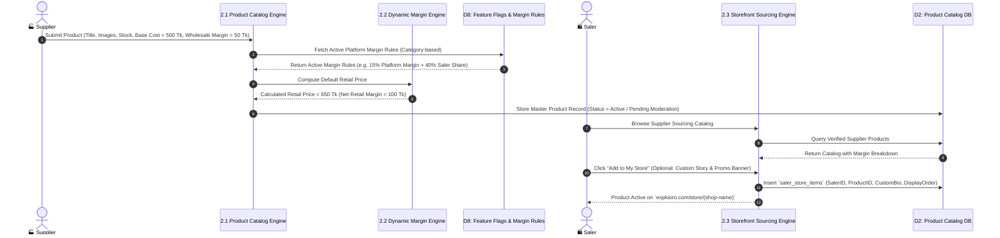

---

### 4.2 Subsystem 4.0: Multi-Supplier Order Splitting & Anti-Fraud Checkout Flow

This process models customer cart checkout, fraud detection (OTP for COD), order validation with PostgreSQL row-locking, and automated sub-order parcel creation.

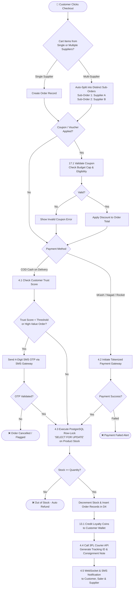

---

### 4.3 Subsystem 5.0: Escrow Holding, Profit Settlement & Clawback Flow

This process models the financial lifecycle: moving funds from Escrow to Available Balance, applying clawbacks on returns, and executing automated MFS payouts.

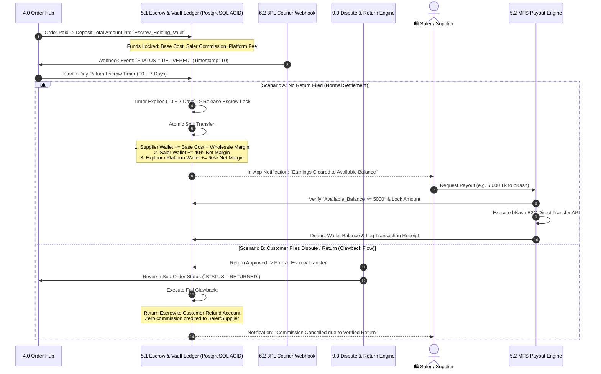

---

### 4.4 Subsystem 7.0: Real-Time Peer-to-Peer Live Chat & Event Pipeline

This process models bi-directional WebSockets, Redis pub/sub routing, and graceful offline fallback.

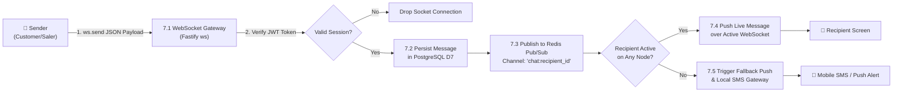

---

### 4.5 Subsystem 8.0: Master Feature Toggle & Admin Governance Flow

This process models how the Super Admin dynamically controls platform modules on the fly without restarting servers or modifying code.

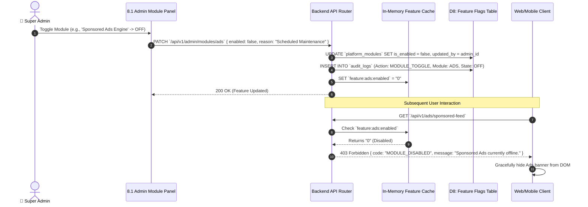

---

### 4.6 Subsystem 9.0: Return, Refund & Dispute Arbitration Flow *(NEW)*

This process models the complete lifecycle from customer return initiation through multi-party arbitration to final refund settlement.

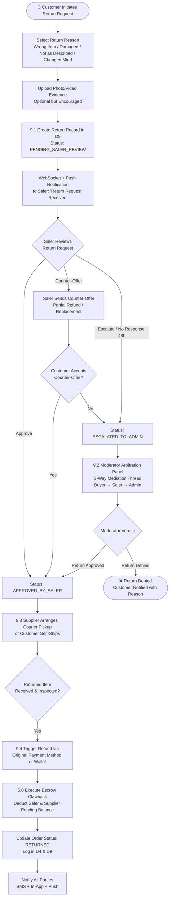

---

### 4.7 Subsystem 10.0: Product Approval & Content Moderation Pipeline *(NEW)*

This process models the automated and manual product review pipeline from submission to publication.

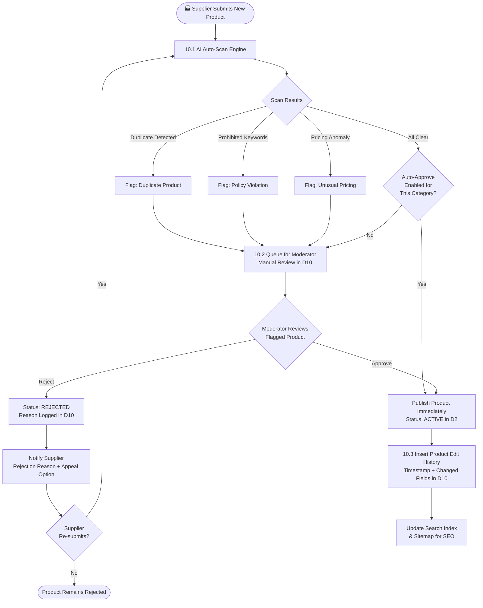

---

### 4.8 Subsystem 11.0: KYC Verification & Blue-Tick Badge Engine *(NEW)*

This process models the multi-step identity verification flow for Suppliers, Salers, and conditional Customer verification.

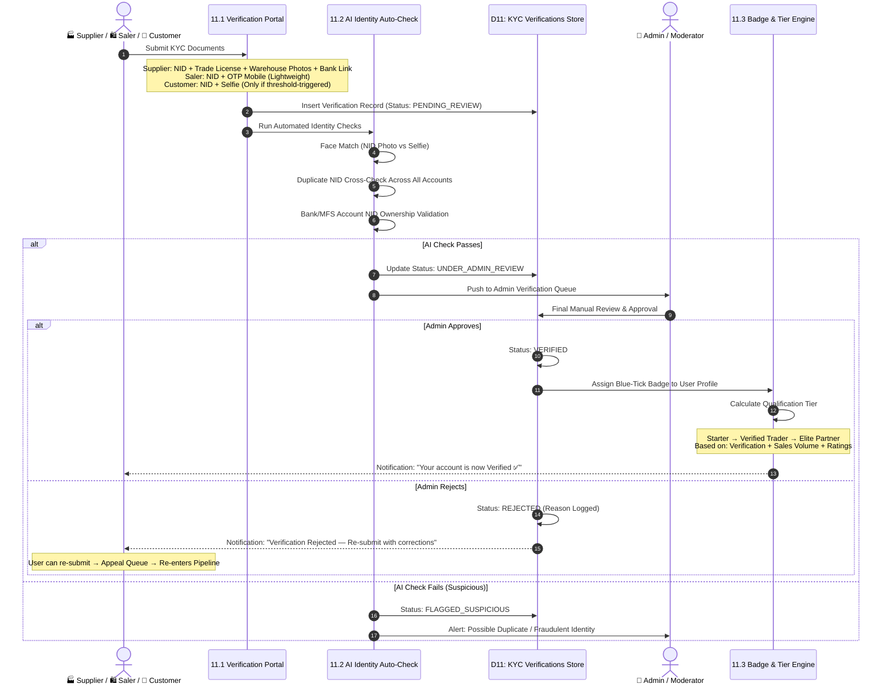

---

### 4.9 Subsystem 12.0: Abandoned Cart Detection & Recovery Engine *(NEW)*

This process models the automatic detection of stale carts and multi-channel recovery nudges.

```mermaid
flowchart TD
    Start([🛒 Customer Adds Items to Cart]) --> CartTimer[12.1 Start Idle Timer<br/>Redis Key: `cart:idle:{user_id}` TTL=20min]
    
    CartTimer --> CheckActivity{Customer Completes<br/>Checkout within 20 min?}
    CheckActivity -->|Yes| ClearTimer[Cancel Recovery Pipeline<br/>Delete Redis Key] --> End([✅ Order Placed])
    
    CheckActivity -->|No, Timer Expires| MarkAbandoned[12.2 Mark Cart as ABANDONED<br/>Insert Record in D12]
    MarkAbandoned --> RecoveryWave1[12.3 Wave 1: In-App Push Notification<br/>'Your items are waiting! Complete checkout']
    RecoveryWave1 --> Wait30min[Wait 30 Minutes]
    Wait30min --> StillAbandoned{Cart Still<br/>Abandoned?}
    StillAbandoned -->|No| End2([✅ Recovered])
    StillAbandoned -->|Yes| RecoveryWave2[12.4 Wave 2: SMS Reminder<br/>'Your Explooro bag has items selling fast!<br/>Checkout: short-link']
    
    RecoveryWave2 --> SalerDashboard[12.5 Update Saler Dashboard<br/>Abandoned Cart Analytics Counter]
    SalerDashboard --> SalerAction{Saler Triggers<br/>Custom Discount?}
    SalerAction -->|Yes| SendPromo[12.6 Push Personalized<br/>Limited-Time Promo to Customer]
    SalerAction -->|No| End3([Cart Expires After 7 Days])
```

---

### 4.10 Subsystem 13.0: Gamification, Loyalty Coins & Leaderboard Engine *(NEW)*

This process models how users earn coins, redeem them, and how leaderboard rankings are calculated.

```mermaid
flowchart TD
    subgraph Earning["🪙 Coin Earning Events"]
        DailyLogin[Daily App Check-In<br/>+10 Coins] --> CoinWallet
        PurchaseComplete[Order Delivered<br/>+2% of Order Value as Coins] --> CoinWallet
        WriteReview[Submit Photo Review<br/>+20 Coins] --> CoinWallet
        VideoReview[Submit Video Review<br/>+40 Coins (2x Bonus)] --> CoinWallet
        ReferFriend[Friend's First Purchase<br/>+50 Coins] --> CoinWallet
        DailyQuest[Complete Daily Quest<br/>+Variable Coins] --> CoinWallet
    end

    CoinWallet[13.1 Update Customer Coin Balance<br/>in D13: `loyalty_coins` Table]

    subgraph Redemption["💰 Coin Redemption at Checkout"]
        CoinWallet --> CustomerCheckout[Customer Applies Coins<br/>at Checkout]
        CustomerCheckout --> CheckCap{Coins <= Max<br/>Redemption Cap<br/>per Order?}
        CheckCap -->|Yes| DeductCoins[13.2 Deduct Coins<br/>Apply Discount to Order Total<br/>100 Coins = Tk. 10]
        CheckCap -->|No| CapError[Apply Max Allowed<br/>Show Remaining Coins]
        CapError --> DeductCoins
    end

    subgraph Leaderboard["🏆 Monthly Leaderboard & Badges"]
        SalerSales[Track Saler Monthly Sales Volume] --> RankCalc[13.3 Calculate Monthly Rankings<br/>Sort by: Revenue, Orders, Ratings]
        RankCalc --> UpdateBoard[Update Leaderboard in D13]
        UpdateBoard --> AssignBadge{Sales Milestone<br/>Reached?}
        AssignBadge -->|Yes| BadgeUp[Upgrade Badge Tier<br/>Bronze → Silver → Gold → Diamond]
        AssignBadge -->|No| KeepBadge[Retain Current Badge]
        
        MonthEnd[Month-End Trigger] --> BonusPool[13.4 Distribute Bonus Pool<br/>Cash + Free Ad Credits<br/>to Top 10 Salers]
    end

    subgraph Quests["🎮 Daily Missions & Streaks"]
        QuestList[Daily Quest List<br/>e.g. Share 3 Products on WhatsApp] --> QuestComplete{Quest<br/>Completed?}
        QuestComplete -->|Yes| CreditReward[Credit Quest Coins + Ad Credits]
        CreditReward --> StreakCheck{7-Day Streak<br/>Active?}
        StreakCheck -->|Yes| StreakBonus[Apply 2x Streak Multiplier]
        StreakCheck -->|No| ResetStreak[Reset Streak Counter]
    end
```

---

### 4.11 Subsystem 14.0: Referral & Network Growth Engine *(NEW)*

This process models referral link generation, attribution tracking, and multi-tier commission flows.

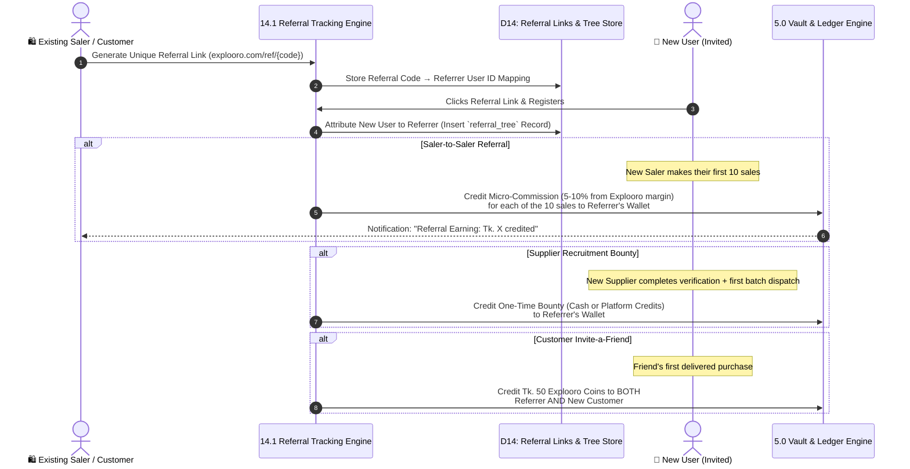

---

### 4.12 Subsystem 15.0: Live Stream Commerce Engine *(NEW)*

This process models the end-to-end live broadcasting, product pinning, in-stream purchasing, and replay archiving flow.

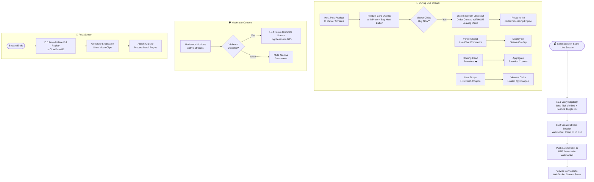

---

### 4.13 Subsystem 16.0: Social Group Buying & Team Purchase Engine *(NEW)*

This process models viral team-discount mechanics with time-limited group formation.

```mermaid
flowchart TD
    Start([🛒 Customer Selects 'Team Purchase']) --> DisplayPrices[Show Dual Pricing<br/>Solo: Tk. 500 vs Team of 3: Tk. 400]
    
    DisplayPrices --> InitiateTeam[16.1 Create Team Purchase Session<br/>24-Hour Countdown Timer Starts<br/>Record in D16]
    InitiateTeam --> GenerateLink[Generate Shareable Invite Link<br/>explooro.com/team/{team_id}]
    GenerateLink --> ShareLink[Customer Shares Link via<br/>WhatsApp / Messenger / Facebook]

    ShareLink --> FriendJoins[Friend Clicks Link<br/>& Places Order at Team Price]
    FriendJoins --> UpdateCount[16.2 Increment Team Member Count<br/>Check: Team Full?]

    UpdateCount --> TeamFull{Required Members<br/>Reached? (e.g. 3)}
    TeamFull -->|Yes| ConfirmAll[16.3 Confirm ALL Team Orders<br/>at Discounted Rate<br/>Lock Stock for All Items]
    ConfirmAll --> ProcessOrders[Route Each Order to<br/>4.0 Order Processing Engine]
    ProcessOrders --> NotifyTeam[Notify All Team Members<br/>'Group Discount Confirmed! 🎉']

    TeamFull -->|No| CheckTimer{24-Hour Timer<br/>Expired?}
    CheckTimer -->|No| WaitMore[Wait for More<br/>Friends to Join]
    WaitMore --> FriendJoins
    CheckTimer -->|Yes| AutoCancel[16.4 Auto-Cancel ALL Pending<br/>Team Orders]
    AutoCancel --> FullRefund[100% Refund to All<br/>Participants (Zero Penalty)]
    FullRefund --> NotifyFail[Notify: 'Team didn't fill in time.<br/>Try again or buy at solo price.']
```

---

### 4.14 Subsystem 17.0: Coupon, Voucher & Flash Sale Campaign Engine *(NEW)*

This process models the creation, validation, and application of discount codes and time-limited flash sales.

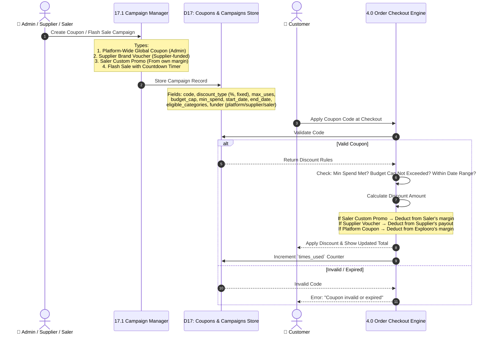

---

### 4.15 Subsystem 18.0: Internationalization (i18n) & Language Switching Engine *(NEW)*

This process models how language dictionaries are loaded, switched, and managed dynamically.

```mermaid
flowchart TD
    subgraph AdminManagement["✍️ Editor / Admin Side"]
        EditorUI[Editor Dashboard<br/>i18n Translation Manager] --> EditStrings[Add / Edit Translation<br/>Key-Value Pairs]
        EditStrings --> SaveDB[18.1 Save to D18:<br/>`i18n_dictionaries` Table<br/>Locale: en / bn / ar]
        SaveDB --> InvalidateCache[Invalidate Redis<br/>Language Cache]
        
        AddLanguage[Admin Adds New Language<br/>e.g. Arabic] --> UploadJSON[Upload ar.json<br/>Translation Dictionary]
        UploadJSON --> SaveDB
        UploadJSON --> EnableRTL[Enable RTL Layout<br/>Flag for Arabic]
    end

    subgraph ClientSide["🌐 Client-Side Rendering"]
        PageLoad[User Opens Explooro] --> CheckLocale{Stored Locale<br/>in LocalStorage?}
        CheckLocale -->|Yes| LoadCached[Load Cached<br/>Language Dictionary]
        CheckLocale -->|No| DetectBrowser[Detect Browser Language<br/>Default: English]
        DetectBrowser --> FetchDict[18.2 Fetch Language Dict<br/>from Redis Cache / API]
        LoadCached --> RenderUI[Render All UI Labels<br/>from Dictionary Keys]
        FetchDict --> RenderUI

        UserSwitches[User Taps Language<br/>Switcher 🌐] --> SwapDict[18.3 Swap Active Dictionary<br/>Zero Page Reload]
        SwapDict --> PersistChoice[Save Choice to<br/>LocalStorage + User Profile DB]
        SwapDict --> ReRender[Re-Render All UI<br/>Components Instantly]
        
        RTLCheck{Is Language<br/>RTL? (Arabic/Urdu)} -->|Yes| ApplyRTL[Apply CSS `dir='rtl'`<br/>Mirror Layout]
        RTLCheck -->|No| KeepLTR[Keep Default LTR]
    end
```

---

### 4.16 Subsystem 19.0: Batch/FEFO Expiration & Multi-Warehouse Proximity Routing *(NEW)*

This process models batch-level inventory tracking, FEFO automated dispatch, expiry alerts, and GIS-based warehouse routing.

```mermaid
flowchart TD
    subgraph BatchIntake["📦 Supplier Stock Intake"]
        SupplierAddsStock[Supplier Adds Stock<br/>for Existing Product] --> TagBatch[19.1 Tag Batch/Lot Number<br/>+ Manufacturing Date<br/>+ Expiration Date]
        TagBatch --> StoreBatch[Store in D19:<br/>`product_batches` Table<br/>Linked to Product ID + Warehouse Node]
    end

    subgraph FEFODispatch["🔄 FEFO Automated Dispatch"]
        OrderConfirmed([Order Confirmed for Product X]) --> QueryBatches[19.2 Query All Active Batches<br/>for Product X at Selected Warehouse]
        QueryBatches --> SortFEFO[Sort by Expiration Date ASC<br/>First Expire, First Out]
        SortFEFO --> SelectBatch[Select Earliest-Expiring Batch<br/>with Sufficient Stock]
        SelectBatch --> DeductBatch[Deduct Qty from<br/>Selected Batch Record]
        DeductBatch --> PackingSlip[Generate Packing Slip<br/>with Batch/Lot Number]
    end

    subgraph ExpiryAlerts["⚠️ Expiry Early Warning"]
        DailyCron[Daily Cron Job Scan] --> CheckExpiry{Any Batch Expiring<br/>within 30-60 Days?}
        CheckExpiry -->|Yes| AlertSupplier[19.3 Notify Supplier:<br/>'Batch X expires in 30 days<br/>Launch clearance sale?']
        AlertSupplier --> AutoClearance[Offer 1-Click Clearance<br/>Flash Sale Discount]
        CheckExpiry -->|No| NoAction[No Action Needed]
    end

    subgraph BatchRecall["🚨 Batch Recall Isolation"]
        QualityIssue([Quality Defect Detected]) --> IsolateBatch[19.4 Admin Freezes<br/>Specific Batch/Lot Number]
        IsolateBatch --> BlockOrders[Block All Orders<br/>from Frozen Batch]
        IsolateBatch --> NotifyBuyers[Notify All Buyers<br/>Who Received Items<br/>from This Batch]
    end

    subgraph ProximityRouting["📍 Multi-Warehouse GIS Routing"]
        OrderPlaced([Customer Places Order]) --> GetAddress[Extract Customer<br/>District / Upazila]
        GetAddress --> QueryWarehouses[19.5 Query All Supplier<br/>Warehouse Nodes with Stock]
        QueryWarehouses --> CalcDistance[Calculate GIS Distance<br/>Customer ↔ Each Warehouse]
        CalcDistance --> SelectNearest[Select Nearest Warehouse<br/>with Available Stock]
        SelectNearest --> RouteOrder[Route Order to<br/>Selected Warehouse Node]
        RouteOrder --> CreateShipment[Create Consignment<br/>from Nearest Hub]
    end
```

---

### 4.17 Subsystem 20.0: WhatsApp & Messenger Conversational Commerce Bridge *(NEW)*

This process models Meta API integration, incoming message routing, and in-chat transactional checkout.

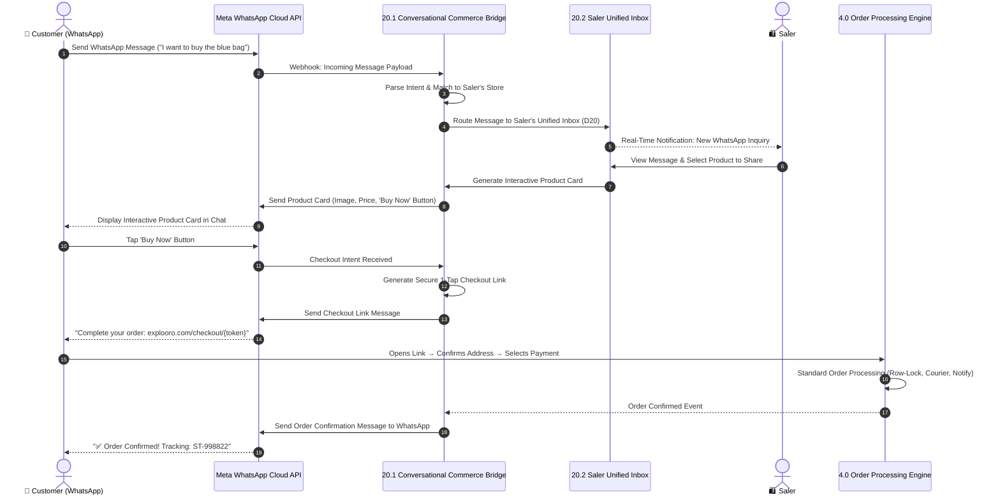

---

## 5. Comprehensive Data Dictionary (Core Entities & Schema Mapping)

### 5.1 Data Stores & Schema Entities

| Data Store ID | Data Store Name | Primary Technology | Key Tables / Keys | Description & Integrity Rules |
| :--- | :--- | :--- | :--- | :--- |
| **D1** | **Users & RBAC Store** | PostgreSQL 16 | `users`, `roles`, `user_roles`, `sessions` | User credentials, role capabilities, active session tokens. |
| **D2** | **Product & Catalog Store** | PostgreSQL 16 | `products`, `product_variants`, `saler_store_items`, `categories` | Base cost, wholesale margin, retail price formulas, stock inventory. |
| **D3** | **Storefront & Content Store** | PostgreSQL 16 | `virtual_stores`, `story_posts`, `sponsored_campaigns` | Saler shop customization, storytelling blogs, internal paid ad campaigns. |
| **D4** | **Order & Sub-Order Store** | PostgreSQL 16 | `orders`, `sub_orders`, `order_items`, `order_status_history` | Multi-supplier split orders, customer addresses, invoice metadata. |
| **D5** | **Vault & Ledger Store** | PostgreSQL 16 | `wallets`, `escrow_entries`, `ledger_transactions`, `payout_requests` | Strict double-entry accounting for financial balances, escrow timers, MFS payouts. |
| **D6** | **Logistics & Delivery Store** | PostgreSQL 16 | `shipments`, `courier_webhooks`, `cod_settlements` | Consignment notes, Steadfast/Pathao tracking status, COD reconciliation. |
| **D7** | **Chat & Live In-Memory Store** | Redis 7 + PostgreSQL | `chat_messages`, Redis Keys: `session:*`, `user:online:*` | Real-time messages, WebSocket session bindings, rate-limit counters. |
| **D8** | **Governance & Feature Store** | Redis 7 + PostgreSQL | `platform_modules`, `platform_settings`, `audit_logs` | Dynamic feature toggle states, dynamic profit split formulas, system logs. |
| **D9** | **Returns & Disputes Store** | PostgreSQL 16 | `return_requests`, `dispute_threads`, `dispute_messages`, `refund_records` | Return lifecycle tracking, 3-way arbitration threads, refund settlement logs. |
| **D10** | **Product Moderation Store** | PostgreSQL 16 | `moderation_queue`, `product_edit_history`, `ai_scan_results` | Auto-scan results, moderator verdicts, product change audit trail. |
| **D11** | **KYC & Verification Store** | PostgreSQL 16 | `kyc_verifications`, `kyc_documents`, `verification_status_history` | NID/Trade License documents, AI face-match results, blue-tick badge assignments. |
| **D12** | **Abandoned Cart Store** | Redis 7 + PostgreSQL | `abandoned_carts`, Redis Keys: `cart:idle:*` | Idle cart detection timers, recovery SMS/push logs, Saler analytics. |
| **D13** | **Gamification & Loyalty Store** | PostgreSQL 16 | `loyalty_coins`, `coin_transactions`, `leaderboard_rankings`, `daily_quests`, `badge_tiers` | Coin balances, earning/redemption history, monthly rankings, quest progress, streak multipliers. |
| **D14** | **Referral & Growth Store** | PostgreSQL 16 | `referral_codes`, `referral_tree`, `referral_commissions` | Unique referral link mappings, parent-child attribution tree, micro-commission ledger. |
| **D15** | **Live Stream Store** | PostgreSQL 16 + Cloudflare R2 | `live_streams`, `pinned_products`, `stream_reactions`, `stream_replays` | Active stream sessions, pinned product overlays, archived replay clips. |
| **D16** | **Group Buying Store** | PostgreSQL 16 | `team_purchases`, `team_members`, `team_status_history` | Team session records, 24h countdown timers, member join tracking. |
| **D17** | **Coupons & Campaigns Store** | PostgreSQL 16 | `coupons`, `vouchers`, `flash_sales`, `coupon_usage_log` | Promo codes, budget caps, flash sale timers, per-user redemption tracking. |
| **D18** | **i18n Language Store** | Redis 7 + PostgreSQL | `i18n_dictionaries`, `supported_languages`, Redis Keys: `lang:*` | Translation key-value pairs, active language list, cached dictionary snapshots. |
| **D19** | **Batch & Warehouse Store** | PostgreSQL 16 | `product_batches`, `warehouse_nodes`, `warehouse_stock`, `batch_recalls` | Lot/batch numbers, expiration dates, multi-node stock levels, GIS coordinates. |
| **D20** | **WhatsApp Commerce Store** | PostgreSQL 16 | `wa_conversations`, `wa_product_cards`, `wa_checkout_intents` | Incoming WhatsApp messages, interactive product cards sent, checkout link tracking. |

---

### 5.2 Key Data Packet Payloads (Event Payloads)

#### A. Order Creation Payload (`OrderCreatedEvent`)
```json
{
  "order_id": "ord_89234710",
  "customer_id": "usr_99120",
  "total_amount_minor": 130000,
  "currency": "BDT",
  "payment_method": "COD",
  "is_otp_verified": true,
  "coupon_applied": { "code": "EID2026", "discount_minor": 5000, "funder": "platform" },
  "coins_redeemed": { "coins_used": 100, "discount_minor": 1000 },
  "sub_orders": [
    {
      "sub_order_id": "sub_01",
      "supplier_id": "sup_104",
      "saler_id": "sal_205",
      "warehouse_node": "wh_dhaka_01",
      "items": [
        { "product_id": "prd_55", "qty": 2, "base_price": 50000, "retail_price": 65000, "batch_id": "batch_A1" }
      ],
      "base_subtotal": 100000,
      "saler_commission": 12000,
      "platform_margin": 18000,
      "courier": "STEADFAST",
      "consignment_id": "ST-998822"
    }
  ],
  "referral_attribution": { "referrer_id": "sal_102", "type": "customer_invite" },
  "created_at": "2026-08-18T19:45:00Z"
}
```

#### B. Escrow Settlement Payload (`EscrowSettlementEvent`)
```json
{
  "escrow_id": "esc_77192",
  "sub_order_id": "sub_01",
  "status": "CLEARED_TO_AVAILABLE",
  "hold_period_days": 7,
  "delivered_timestamp": "2026-08-18T12:00:00Z",
  "settlement_timestamp": "2026-08-25T12:00:00Z",
  "transfers": [
    { "destination_wallet": "wal_sup_104", "amount": 100000, "type": "SUPPLIER_BASE_PAYOUT" },
    { "destination_wallet": "wal_sal_205", "amount": 12000, "type": "SALER_PROFIT_SPLIT" },
    { "destination_wallet": "wal_platform_master", "amount": 18000, "type": "EXPLOORO_REVENUE" }
  ]
}
```

#### C. Return Request Payload (`ReturnRequestEvent`) *(NEW)*
```json
{
  "return_id": "ret_44210",
  "order_id": "ord_89234710",
  "sub_order_id": "sub_01",
  "customer_id": "usr_99120",
  "reason": "DAMAGED",
  "evidence_urls": ["https://r2.explooro.com/evidence/ret_44210_1.jpg"],
  "status": "PENDING_SALER_REVIEW",
  "created_at": "2026-08-20T10:30:00Z"
}
```

#### D. Team Purchase Payload (`TeamPurchaseEvent`) *(NEW)*
```json
{
  "team_id": "team_8821",
  "initiator_id": "usr_99120",
  "product_id": "prd_55",
  "solo_price_minor": 50000,
  "team_price_minor": 40000,
  "required_members": 3,
  "current_members": ["usr_99120", "usr_88210"],
  "status": "WAITING_FOR_MEMBERS",
  "expires_at": "2026-08-19T19:45:00Z",
  "invite_link": "https://explooro.com/team/team_8821"
}
```

---

## 6. Security, Concurrency & Data Flow Integrity Rules

1. **Financial Concurrency Protection:**
   * All balance updates to `wallets` and `escrow_entries` MUST be executed within PostgreSQL ACID transactions with `SERIALIZABLE` or `SELECT FOR UPDATE` row-locking to eliminate race conditions.
2. **Idempotent Webhook Ingestion:**
   * 3PL Courier and MFS Payment webhooks are verified via cryptographic HMAC signatures. Duplicate webhook deliveries are rejected using an idempotent Redis cache lock (`SETNX webhook:id`).
3. **Optimistic UI with Background Sync:**
   * Critical user actions (Chat messages, Sourcing toggles) reflect instantly in the client UI while queued for background network acknowledgment.
4. **Audit Trail Immutability:**
   * Financial transactions and Admin feature toggle changes are stored in append-only audit tables (`audit_logs`, `ledger_transactions`) with zero `UPDATE` or `DELETE` permissions granted to standard application roles.
5. **KYC Document Encryption:**
   * All NID photos, Trade License scans, and selfie verification images are stored encrypted at rest (AES-256) in Cloudflare R2 with time-limited signed access URLs.
6. **Referral Fraud Prevention:**
   * Self-referral and circular referral chains are detected via NID + mobile number cross-checking. Duplicate account detection blocks multi-account referral abuse.
7. **Live Stream Content Safety:**
   * Moderators have real-time authority to terminate live streams. All streams are logged with timestamps, viewer counts, and pinned product interactions for audit.
8. **Coupon Budget Enforcement:**
   * Coupon redemption checks are atomic — concurrent checkout attempts cannot overdraw a coupon's budget cap due to Redis distributed locking (`SETNX coupon:budget:lock`).

---

## 7. Subsystem Verification & Implementation Mapping

| Subsystem | Verified DFD Coverage | PRD / Idea Prop Alignment | Ready for Code Generation |
| :--- | :--- | :--- | :--- |
| **1.0 Auth & RBAC** | ✅ JWT, SMS OTP, Role Middleware | PRD §2.0 | ✅ Yes |
| **2.0 Catalog & Sourcing** | ✅ Base/Margin split, 1-Click Sourcing | PRD §3.2, §3.3 | ✅ Yes |
| **3.0 Storefront & Ads** | ✅ Virtual Shop, Story posts, Ad campaigns | Idea Prop §A, §B | ✅ Yes |
| **4.0 Order & Splitting** | ✅ Multi-supplier split, Stock row-lock, Coupon application | PRD §3.2, Gap 3 | ✅ Yes |
| **5.0 Escrow & Vault** | ✅ 7-day Lock, Clawback, bKash Payout | PRD §3.2, Gap 2 | ✅ Yes |
| **6.0 3PL Logistics** | ✅ Steadfast/Pathao sync, COD tracking | Idea Prop §N, Gap 6 | ✅ Yes |
| **7.0 Real-Time Chat** | ✅ Fastify WebSockets, Redis Pub/Sub | PRD §3.4 | ✅ Yes |
| **8.0 Feature Toggles** | ✅ Admin Module Control, Dynamic flags | PRD §3.1 | ✅ Yes |
| **9.0 Return & Disputes** | ✅ Multi-step arbitration, Clawback | Idea Prop §F | ✅ Yes |
| **10.0 Product Moderation** | ✅ AI scan, Manual review, Appeal flow | Idea Prop §G | ✅ Yes |
| **11.0 KYC & Verification** | ✅ Multi-step KYC, Blue-tick, Tier progression | Idea Prop §C | ✅ Yes |
| **12.0 Abandoned Cart** | ✅ Idle detection, SMS/Push recovery, Saler promo | Idea Prop §Q | ✅ Yes |
| **13.0 Gamification & Coins** | ✅ Earning, Redemption, Leaderboard, Quests, Streaks | Idea Prop §R, §X, §AE | ✅ Yes |
| **14.0 Referral Engine** | ✅ Link generation, Attribution tree, Multi-tier commission | Idea Prop §Y | ✅ Yes |
| **15.0 Live Stream Commerce** | ✅ Broadcast, Pin products, In-stream checkout, Archive | Idea Prop §U | ✅ Yes |
| **16.0 Group Buying** | ✅ Team formation, 24h timer, Auto-cancel/refund | Idea Prop §V | ✅ Yes |
| **17.0 Coupon & Campaigns** | ✅ Platform/Supplier/Saler coupons, Flash sale timers | Idea Prop §S | ✅ Yes |
| **18.0 i18n Language** | ✅ JSON dictionaries, Dynamic switch, RTL, Admin editor | Idea Prop §L | ✅ Yes |
| **19.0 Batch/FEFO/Warehouse** | ✅ Batch tagging, FEFO dispatch, Expiry alerts, GIS routing | Idea Prop §AJ, §AK | ✅ Yes |
| **20.0 WhatsApp Bridge** | ✅ Meta API webhook, Unified inbox, In-chat checkout | Idea Prop §AD | ✅ Yes |

---

### Coverage Summary

| Metric | Value |
| :--- | :--- |
| Total Subsystems | **20** |
| Level 2 Detailed Micro-Flows | **17** |
| Data Stores Documented | **20 (D1–D20)** |
| Event Payloads Documented | **4** |
| Security & Integrity Rules | **8** |
| Coverage of idea proposition.md (A–AK) | **~95%** |

---
*Updated on 2026-08-18 as the authoritative Data Flow Architecture Document for Explooro (v2.0).*
