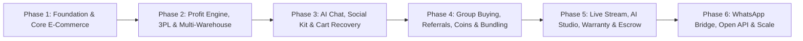

# 🚀 Explooro — Business & Technical Idea Proposition

> **Next-Generation Social Commerce, Reseller Partnership & Smart Sourcing Ecosystem**  
> *Empowering manufacturers, digital micro-entrepreneurs (Salers), and everyday shoppers to trade, share profits, and grow together.*

---

## 1. Executive Summary

**Explooro** is a high-performance, industry-scale social e-commerce and reselling platform designed around a collaborative, **profit-sharing partnership model**.

Unlike conventional single-vendor stores or traditional dropshipping websites, Explooro bridges physical inventory owners (**Manufacturers & Suppliers**) with digital micro-entrepreneurs (**Salers**) and end **Customers** in a single interconnected, self-sustaining circular economy.

### 🌟 The Core Vision
* **Manufacturers & Suppliers**: Focus purely on production, inventory management, and fast fulfillment.
* **Salers (Virtual Resellers)**: Build personalized virtual storefronts without holding physical stock, sourcing supplier items and driving sales through storytelling, community engagement, and internal advertising.
* **Customers**: Enjoy a personalized, social shopping experience with transparent ratings, verified suppliers, AI-assisted product discovery, and one-click purchasing.
* **Fluid Role Upgrades**: Any customer can upgrade to become a Saler with one click; any supplier or Saler can purchase products from other members for personal or business needs.

---

## 2. Dynamic Business & Profit-Sharing Model

The financial backbone of Explooro is a **dynamic, multi-tier profit-sharing engine**. Margins and profit splits are **not fixed or rigid**—they can be adjusted by platform administrators over time based on business conditions, market dynamics, promotional campaigns, or specific product categories.

```
┌─────────────────────────┐     Base Price + Manufacturer Margin     ┌────────────────────────────────────┐
│  Supplier/Manufacturer  │ ───────────────────────────────────────► │   Explooro Dynamic Pricing Engine   │
└─────────────────────────┘                                          │ (Configurable via Admin Dashboard) │
                                                                     └─────────────────┬──────────────────┘
                                                                                       │
                                                  ┌────────────────────────────────────┴────────────────────────────────────┐
                                                  ▼                                                                         ▼
                                     ┌─────────────────────────┐                                               ┌─────────────────────────┐
                                     │      Saler Profit       │                                               │     Explooro Margin      │
                                     │ (Configurable: e.g. 40%)│                                               │ (Configurable: e.g. 60%)│
                                     └─────────────────────────┘                                               └─────────────────────────┘
```

### 💰 Dynamic Pricing & Profit Rules

1. **Configurable Profit-Sharing Splits**:
   * The profit split ratio between Explooro and Salers is flexible and manageable from the Admin Panel.
   * *Example Scenario*: During normal operations, net retail profit is split **40% Saler / 60% Explooro**. During promotional seasons or for top-tier Salers, this ratio can be boosted (e.g., 50/50, 45/55, or custom tier-based splits).
2. **Product Listing & Dynamic Pricing Calculation**:
   * **Supplier Listing**: The supplier uploads their product with the base production cost plus their own wholesale profit (e.g., Base = **Tk. 500**).
   * **Dynamic Retail Adjustment**: Explooro calculates the final customer retail price automatically or manually according to active margin rules and market competition (e.g., Retail Price = **Tk. 600**, Net Retail Margin = **Tk. 100**).
3. **Settlement Upon Order Completion**:
   * When a customer purchases from a Saler's virtual storefront:
     * **Supplier Receives**: Full base cost + wholesale margin (**Tk. 500**).
     * **Saler Receives**: Active percentage of retail profit (e.g., 40% of Tk. 100 = **Tk. 40**).
     * **Explooro Receives**: Platform operating margin (e.g., 60% of Tk. 100 = **Tk. 60**).
4. **Digital Profit Vault & Payouts**:
   * Every subscriber account features an integrated **Digital Vault (Wallet)** where earnings are credited in real time upon verified delivery.
   * Instant tracking of available balance, pending earnings, and historical withdrawal statements.
   * Flexible payouts supported via **bKash, Nagad, Rocket, and Direct Bank Transfer** (with both automated batch payouts and manual approval workflows).

5. **Zero Initial Fees & Future Configurable Subscription/Fee Engine**:
   * **100% Free Onboarding at Launch**: During the initial launch and growth phase, Explooro charges **ZERO registration fees, ZERO monthly subscription fees, and ZERO listing fees** to Manufacturers, Suppliers, and Salers. This removes all entry barriers and drives rapid community adoption.
   * **Future-Ready Scalable Fee System**: A comprehensive fee and subscription engine is architected into the core platform, remaining inactive (`OFF`) initially.
   * **Admin & Authorized Staff Governance**: When the business matures, the **Super Admin (or authorized staff appointed by the Admin)** can activate and configure fee structures directly from the dashboard:
     * *Optional Subscription Tiers*: Free Starter vs. Pro/Elite Merchant plans (with perks like lower commission rates, VIP ad credits, or advanced analytics).
     * *One-Time Verification/Registration Fees*: Optional onboarding fee for high-tier verified manufacturers.
     * *Promotional Waivers & Grandfathering*: Ability to exempt early adopters, offer seasonal free trials, or set custom fee waivers per merchant.

---

## 3. User Roles & Subscriber Ecosystem

Explooro operates on a **multi-level Role-Based Access Control (RBAC)** architecture that categorizes users into **Marketplace Subscriber Tiers** and **Platform Governance & Staff Roles**.

### A. Marketplace Subscriber Tiers

| Role | Who They Are | Key Capabilities |
| :--- | :--- | :--- |
| **🏭 Supplier / Manufacturer** | Physical inventory holders and factory owners. | • Upload products with base cost, wholesale margins & stock levels.<br>• Manage order fulfillment, packaging, and dispatch.<br>• Activate Saler mode to resell products from other suppliers.<br>• Real-time stock alerts and wholesale performance analytics. |
| **🛍️ Saler (Virtual Reseller)** | Digital creators, marketers, micro-entrepreneurs. | • Add any supplier item to their virtual shop with zero inventory risk.<br>• Market via storytelling, problem-solving posts, and video clips.<br>• Run paid sponsored ads within Explooro to boost reach.<br>• Earn commissions on every completed purchase. |
| **🛒 Customer / Visitor** | Everyday shoppers looking for curated products. | • Browse multi-seller catalogs, discover trending items.<br>• Follow favorite creators, Salers, and verified manufacturers.<br>• 1-click upgrade to become a Saler anytime. |

### B. Platform Governance & Administrative Hierarchy

| Administrative Role | Operational Scope | Core Permissions |
| :--- | :--- | :--- |
| **👑 Super Admin** | Complete Platform Authority & Executive Oversight | • Full financial governance, revenue analytics, profit split controls.<br>• Master Feature Toggle Panel (turn any module ON/OFF).<br>• User verification approval (NID, Trade License), payout approvals.<br>• Staff role management (create/assign Admins, Moderators, Editors).<br>• System backups, database snapshots, and infrastructure health. |
| **🛡️ Moderator** | Trust, Safety, Compliance & Dispute Arbitration | • Product approval and listing moderation queue.<br>• Flagged content, fake reviews, and abusive user report handling.<br>• Return & refund dispute arbitration between Buyer ↔ Saler ↔ Supplier.<br>• Issuing seller warnings, policy strikes, or temporary suspensions. |
| **✍️ Editor** | Content, Communications, Marketing & Localization | • Managing homepage banners, hero sliders, and featured collections.<br>• Publishing official "What's New" release notes and announcements.<br>• Curating storytelling and content commerce articles.<br>• Managing multi-language translation dictionaries (i18n UI keys). |

### 🌐 Interconnected Trading Network (Circular Economy)
* Users are never restricted to a single rigid persona.
* A supplier can purchase raw materials, accessories, or personal items from other Salers or suppliers.
* Salers can buy complementary goods from one another to create product bundles.
* Fosters an active, self-sustaining community where members satisfy each other's commercial needs.

---

## 4. Key Platform Features

> [!IMPORTANT]
> **Every feature and module listed in this section is individually toggleable (ON/OFF) from the Super Admin Dashboard.** No module is permanently hardwired into the platform. If a feature is not needed at launch or needs to be paused for business reasons, it can be disabled without touching the source code. It can be re-enabled at any time as the business grows.

### 🎛️ Platform Module Control Panel (Feature Toggle System)

The Super Admin Dashboard includes a centralized **Module Control Panel** — a master list of all platform features, each with a live ON/OFF switch and optional configuration.

```
┌────────────────────────────────────────────────────────────────────────────────────────────────────┐
│                          🎛️  Explooro Admin — Module Control Panel                                  │
├──────────────────────────────────────────────────┬────────────┬────────────────────────────────────┤
│  Module / Feature                                │  Default   │  Notes                             │
├──────────────────────────────────────────────────┼────────────┼────────────────────────────────────┤
│  Supplier / Manufacturer Verification            │  🟢 ON     │  Mandatory before product listing  │
│  Saler (Reseller) Verification                   │  🟢 ON     │  Lightweight NID + OTP             │
│  Customer Identity Verification                  │  🔴 OFF    │  Enable per threshold or globally  │
│  Customer Age Verification                       │  🔴 OFF    │  For age-restricted categories     │
│  Product Approval & Moderation Queue             │  🟢 ON     │  Configurable per category         │
│  Auto-Approval for Products                      │  🔴 OFF    │  Enable to skip manual review      │
│  In-Platform Sponsored Ads Engine                │  🟢 ON     │  Sellers pay to boost listings     │
│  Customer Shopping Concierge Chat (AI)           │  🟢 ON     │  NLP product discovery assistant   │
│  Saler Sourcing Intelligence Chat (AI)           │  🟢 ON     │  Margin & supplier finder          │
│  Real-Time Peer-to-Peer Messaging                │  🟢 ON     │  Customer ↔ Saler ↔ Supplier       │
│  Return & Refund Engine                          │  🟢 ON     │  Return window is configurable     │
│  Dispute Panel (Buyer-Seller Arbitration)        │  🟢 ON     │  Visible to Admin only             │
│  Social Follow & Follower Feed                   │  🟢 ON     │  Platform social layer             │
│  Content Commerce (Storytelling Posts)           │  🟢 ON     │  Blog-style linked product posts   │
│  Physical Shop Open/Close Toggle                 │  🟢 ON     │  For sellers with physical stores  │
│  Blue-Tick Verification Badge                    │  🟢 ON     │  Displayed publicly on profiles    │
│  Qualification Tier System                       │  🟢 ON     │  Starter → Verified → Elite        │
│  Voice Search                                    │  🟢 ON     │  Bengali & English spoken input    │
│  Wishlist / Favorites                            │  🟢 ON     │  Standard e-commerce feature       │
│  1-Click Quick Buy                               │  🟢 ON     │  Bypass cart for fast checkout     │
│  SMS Order Notifications                         │  🟢 ON     │  Each order milestone              │
│  Push Notifications                              │  🟢 ON     │  In-app alerts                     │
│  Email Notifications                             │  🟢 ON     │  Receipts, approvals               │
│  Fraud Detection & Velocity Limits               │  🟢 ON     │  Account abuse prevention          │
│  Review Integrity System (AI Flagging)           │  🟢 ON     │  Detects fake reviews              │
│  Duplicate Account Detection                     │  🟢 ON     │  Cross-checks NID + phone          │
│  User Report & Flag System                       │  🟢 ON     │  Community trust reporting         │
│  Onboarding Agreements & Policy Acceptance       │  🟢 ON     │  Terms acceptance during signup    │
│  Versioned Terms Re-acceptance Prompts           │  🟢 ON     │  Triggered on policy updates       │
│  SEO-Optimized Public Product Pages              │  🟢 ON     │  For external Google traffic       │
│  Social Sharing OG Cards                         │  🟢 ON     │  Facebook/WhatsApp product share   │
│  Dynamic XML Sitemap                             │  🟢 ON     │  Auto-submitted to Google          │
│  Multi-Language Engine (i18n)                    │  🟢 ON     │  English + Bengali at launch       │
│  In-App "What's New" Update Notifications        │  🟢 ON     │  One-time per app release          │
│  Automated Database Backup                       │  🟢 ON     │  Daily/weekly snapshots            │
│  Manual Backup Trigger                           │  🟢 ON     │  Admin 1-click snapshot            │
│  15-Second Video/Audio Walkthroughs              │  🟢 ON     │  Onboarding tutorials              │
│  COD (Cash on Delivery) Payment                  │  🟢 ON     │  Configurable per region           │
│  bKash / Nagad / Rocket Payment                  │  🟢 ON     │  Mobile financial services         │
│  Debit/Credit Card Payment                       │  🔴 OFF    │  Enable when gateway ready         │
│  Seller & Supplier Subscription / Fee Engine     │  🔴 OFF    │  100% Free at launch; Admin toggle │
│  3PL Courier Aggregator & Live GPS Hub           │  🟢 ON     │  Steadfast, Pathao, RedX, Paperfly │
│  Anti-Fraud Fake Order & COD Protection          │  🟢 ON     │  OTP confirmation & success score  │
│  Interactive Live Stream Commerce                │  🟢 ON     │  Live video shopping & pinned cart │
│  Social Group Buying / Team Purchase Engine      │  🟢 ON     │  Viral multi-buyer team discounts  │
│  AI Creative Marketing Studio for Salers         │  🟢 ON     │  1-click product backdrops & reels │
│  Customer Loyalty Points & Explooro Coins         │  🟢 ON     │  Daily check-in & review cashback  │
│  Multi-Tier Referral & Network Growth Engine     │  🟢 ON     │  Viral seller & buyer recruitment  │
│  Social Seller Kit & Auto-Flyer Generator        │  🟢 ON     │  QR code flyers & affiliate links  │
│  Abandoned Cart Recovery Engine                  │  🟢 ON     │  Automated SMS/Push checkout nudge │
│  Gamification, Leaderboard & Seller Rewards      │  🟢 ON     │  Monthly Top Saler & bonus pool    │
│  Coupons, Vouchers & Flash Sale Campaign Engine  │  🟢 ON     │  Platform, supplier & saler promos │
│  Explooro Seller Academy (Micro-Learning Center)  │  🟢 ON     │  Video/audio selling masterclasses │
│  Prescriptive Analytics & Next-Action Insights   │  🟢 ON     │  AI actionable advice for users    │
│  Digital Warranty & Product Protection Engine    │  🟢 ON     │  Warranty cards, claims & counters │
│  AI Smart Inventory & Demand Forecasting         │  🟢 ON     │  Predicts stockouts & season peaks │
│  Cross-Seller Dynamic Product Bundling Engine    │  🟢 ON     │  Multi-seller combo discount packs │
│  WhatsApp & Messenger Conversational Commerce    │  🟢 ON     │  Meta API sync & in-chat checkout  │
│  Daily Challenges & Seller Achievement Quests    │  🟢 ON     │  Gamified daily tasks & credits    │
│  Dynamic Demand Surge & Yield Optimization       │  🟢 ON     │  Live high-demand price alerts     │
│  B2B Wholesale Escrow & Milestone Settlement     │  🟢 ON     │  Secure holding vault for big deals│
│  UGC Video Reviews & Social Proof Wall           │  🟢 ON     │  Shoppable video unboxing clips    │
│  Open Marketplace REST API & Developer SDK       │  🟢 ON     │  Widgets, Facebook group embeds    │
│  Batch & Expiration Management (FEFO Engine)     │  🟢 ON     │  Lot numbers, FEFO & batch recalls │
│  Multi-Location Warehouse & Proximity Routing    │  🟢 ON     │  Fastest closest hub order dispatch│
└──────────────────────────────────────────────────┴────────────┴────────────────────────────────────┘
```

* **How it works**: Each toggle is a database-driven feature flag. When a module is switched OFF, its UI elements are hidden from all users, API endpoints return graceful "feature not available" responses, and no background processes run for that module. Switching it back ON instantly re-activates everything.
* **Granular Control**: Some modules have sub-settings beyond just ON/OFF (e.g., Return Engine has a configurable return window; Customer Verification has threshold-based activation; Product Moderation has per-category auto-approval rules).
* **Change Log**: Every toggle action is logged with admin name, timestamp, and reason — providing a full audit trail of platform configuration history.

---

### A. Dynamic Social Commerce & Marketing Suite
* **Branded Virtual Storefronts**: Each Saler gets a personalized, shareable shop URL, customized banner, bio, and curated collections.
* **Content Commerce & Storytelling**: Salers can publish blog-style stories, problem-solving use cases, and benefit breakdowns linked directly to buyable products.
* **In-Platform Sponsored Ads Engine**:
  * Sellers and suppliers can launch targeted paid promotions within search results, category banners, and social feeds for a micro-budget.
* **Social Networking & Follower System**:
  * Shoppers can follow their favorite Salers and manufacturers for instant product drop notifications.
  * Direct customer-to-seller messaging and community inquiry threads.


### B. Hybrid Physical & Digital Shop Management
* **Physical Store Status Indicator**:
  * Sellers with brick-and-mortar shops can toggle their status between **Open** 🟢 and **Closed** 🔴.
  * Configurable business hours and live timestamp indicators for walk-in customers.

### C. Multi-Layer Trust & Verification Architecture

The platform implements a layered, role-specific identity and trust verification system. Each verification tier is **independently configurable** by the Super Admin — it can be enabled, disabled, or made optional at any time without code changes.

#### 1. 🏭 Manufacturer & Supplier Verification (Active by Default — Mandatory)

Suppliers and manufacturers who want to list products must pass identity and business verification before their products go live. This protects buyers from fraudulent stock and fake businesses.

| Verification Stage | What's Submitted | Review Process |
| :--- | :--- | :--- |
| **Step 1 — Identity Verification** | National ID (NID) photo, selfie with ID | AI-assisted auto-check + Admin final approval |
| **Step 2 — Business Verification** | Trade License, VAT/TIN Certificate (optional), Business address | Manual admin review |
| **Step 3 — Stock & Product Authenticity** | Product sample images, warehouse/factory photos | Admin review + optional in-person audit |
| **Step 4 — Bank/Mobile Account Linking** | bKash/Nagad/Bank account tied to the same NID | System auto-validation |

* **Verification Status Indicators**:
  * 🕐 Pending Review → 🔄 Under Verification → ✅ Verified → 🚫 Rejected (with reason)
* **Rejection with Appeal**: Suppliers whose verification is rejected can re-submit corrected documents with an automated appeal queue.
* **Blue-Tick Badge** displayed publicly on verified supplier profiles and product listings.

#### 2. 🛍️ Saler (Reseller) Verification (Active by Default — Lightweight)

Salers undergo a lighter-weight identity check since they do not hold physical inventory, but enough to ensure accountability:

* **Mandatory**: NID photo + active mobile number (OTP verified).
* **Optional (encouraged)**: Social media profile link or referral from an existing verified Saler.
* **Graduated Trust**: Unverified Salers can operate but are displayed without a badge; verified ones gain higher search visibility, higher earning tiers, and ad eligibility.

#### 3. 🛒 Customer Verification (Inactive by Default — Admin Toggleable)

> **Key Design Decision**: Customer verification is built into the system architecture but is **OFF by default** to minimize onboarding friction for everyday shoppers. The Super Admin can activate it globally, for specific order thresholds, or for specific product categories (e.g., high-value or age-restricted items).

| Verification Mode | Trigger Condition | What's Required |
| :--- | :--- | :--- |
| **Disabled (Default)** | All customers | Only mobile number (OTP login). |
| **Soft Verification** | Orders above a threshold (e.g., Tk. 5,000) | NID + Selfie (one-time). |
| **Full Verification** | Admin-activated globally or per category | NID + Address proof. |
| **Age Verification** | Age-restricted product categories | Date-of-birth + NID. |

#### 4. 🏅 Qualification & Trust Level System

A dynamic qualification ladder that rewards performance, trust, and longevity:

```
Level 1: Starter            →  Level 2: Verified Trader    →  Level 3: Elite Partner
(New account, unverified)      (ID verified, some sales)       (High-performing, trusted)
• Basic listing access          • Priority search placement     • Max profit split bonus
• Default profit split          • Blue-tick badge               • Custom storefront domain
• Standard withdrawal limit     • Higher withdrawal limits      • Dedicated account manager
• No ad eligibility             • Ad campaign access            • Featured placement in homepage
```

---

### D. Intelligent Chat Systems & Product Discovery Engine

```
┌────────────────────────────────────────────────────────────────────────────────────────┐
│                               Explooro Chat Ecosystem                                   │
├───────────────────────────────────────────┬────────────────────────────────────────────┤
│   🛍️ Customer Shopping Assistant Chat     │     💼 Saler Sourcing & Deal Hunter Chat   │
│ • Natural language product discovery      │ • Best wholesale price & margin finder     │
│ • Feature comparison across sellers       │ • High-demand & trending product alerts    │
│ • Budget & category smart matching        │ • Top-rated & verified supplier matching   │
│ • Instant "Add to Cart" from chat         │ • 1-Click "Add to My Store" from chat      │
└───────────────────────────────────────────┴────────────────────────────────────────────┘
```

1. **🛍️ Customer Product Discovery Chat ("Shopping Concierge")**:
   * **Conversational Shopping**: Customers can type or voice-search what they need in natural language (*"Find me a waterproof laptop bag under Tk. 1,500 with top customer ratings"*).
   * **Smart Comparison**: Compares prices, delivery speeds, and warranty terms across different sellers in seconds.
   * **Interactive Product Cards**: Generates product cards inside the conversation with photos, specifications, and instant **"Add to Cart" / "Buy Now"** buttons.
   * **Direct Seller Hand-off**: Seamless transition to a live direct chat with the seller for specific questions.

2. **💼 Saler Sourcing & Deal Hunter Chat ("Sourcing Intelligence")**:
   * **Profit & Margin Hunter**: Salers can query the system to find the highest-profit or best-priced products from manufacturers (*"Show me electronics with profit margins over 35% and 4.5+ star rating"*).
   * **Supplier Quality Vetting**: Filters products by verified blue-tick status, low return rates, and reliable inventory volume.
   * **1-Click Virtual Store Import**: Salers can preview specs, wholesale base cost, and expected profit margin, importing products into their store directly from the chat.
   * **Direct Supplier Negotiations**: Dedicated channel for Salers to chat directly with manufacturers for bulk pricing, customized packaging, or exclusive supply arrangements.

### E. Standard E-Commerce Fundamentals (Engineered for Simplicity)
* **❤️ Add to Favorite / Wishlist**: One-tap heart icon on all product cards to save items for future purchase.
* **🛒 Add to Cart & Sticky Bag**: Sliding cart drawer with instant quantity adjusters (+ / -) and floating cart totals.
* **⚡ 1-Click Quick Buy**: Direct checkout bypassing the cart for ultra-fast single-item purchasing.
* **🔍 Multi-Modal Search**: Auto-suggest text search, **Voice Search** (spoken queries), and visual category grids.
* **📦 Visual Order Tracking**: Clear 4-stage color-coded milestone progress bar:
  `Order Confirmed ✅ ➔ Packaging 📦 ➔ Out for Delivery 🚚 ➔ Delivered 🏠`
  with automated SMS milestone notifications.
* **💳 Frictionless Payment Methods**: Cash on Delivery (COD), Mobile Financial Services (bKash, Nagad, Rocket), and Debit/Credit Cards.
* **⭐ Photo & Voice Customer Reviews**: Visual star ratings with optional photo uploads and short voice reviews.

---

### F. Return, Refund & Dispute Resolution Engine

A clearly structured post-purchase protection framework that builds trust across the entire ecosystem.

* **Return Request Window**: Configurable return window (default: 3–7 days after delivery). Admin can adjust per product category.
* **Return Reasons**: Predefined options (Wrong item, Damaged, Not as described, Changed mind) with optional photo/video evidence.
* **Resolution Workflow**:
  1. Customer raises a return/refund request.
  2. Saler reviews and either approves, counter-offers, or escalates to Explooro Admin.
  3. Supplier arranges pickup or authorizes return.
  4. Refund is credited back to the customer's payment method or wallet.
* **Profit Clawback on Returns**: If a return is approved, the Saler's credited profit for that transaction is automatically deducted from their Vault.
* **Buyer-Seller Dispute Panel**: A structured messaging thread between the buyer and seller visible to Explooro Admin for arbitration.

---

### G. Product Approval & Content Moderation Workflow

Before any product is visible to shoppers, it passes through a configurable review pipeline:

```
Supplier Submits Product ➔ Auto-Check (AI Scan: duplicate, prohibited keywords, pricing anomalies)
                        ➔ [Pass] → Published Immediately (if auto-approve is ON)
                        ➔ [Flagged] → Queued for Admin Manual Review
                        ➔ [Rejected] → Supplier notified with rejection reason + appeal option
```

* **Configurable Auto-Approval**: Admin can enable/disable auto-approval per category (e.g., electronics may require manual review, clothing may auto-approve).
* **Prohibited Content Policy Engine**: Automated keyword and image detection to block counterfeit, illegal, or policy-violating product listings.
* **Product Edit History Log**: Every edit to a product's price, description, or images is logged with timestamps for audit purposes.

---

### H. Platform-Wide Notification System

A unified, multi-channel notification engine covering all subscriber types:

| Notification Type | Channel | Triggered By |
| :--- | :--- | :--- |
| Order placed / confirmed | SMS + In-App | Customer checkout |
| Order shipped / delivered | SMS + In-App | Supplier dispatch update |
| Profit credited to Vault | In-App + Email | Order delivery confirmed |
| New message received | In-App + Push | Chat message from any user |
| Verification approved/rejected | In-App + SMS | Admin action |
| Product approved / rejected | In-App + Email | Admin moderation |
| New follower / subscriber | In-App | Social follow action |
| Payout processed / failed | In-App + SMS | Payment gateway response |
| Platform feature update (What's New) | In-App (1x per update) | App deployment event |
| Return/refund status change | In-App + SMS | Dispute resolution workflow |

* **Notification Preferences**: Each user controls which notification types they receive per channel (in-app toggle panel).

---

### I. Fraud Prevention & Platform Abuse Controls

* **Account Velocity Limits**: Rate limiting on product uploads, review submissions, and order placements to detect bot-like behavior.
* **Review Integrity System**: AI-flagged suspicious review patterns (mass reviews from same IP, 5-star reviews within minutes of purchase) queued for admin audit.
* **Wallet Fraud Detection**: Unusual withdrawal patterns trigger a hold and manual review before fund release.
* **Duplicate Account Detection**: Cross-check NID numbers and mobile numbers across accounts to prevent multi-account abuse.
* **Report & Flag System**: Any user can report a product, seller, or review for policy violations; flagged reports are handled through the Admin moderation queue.

---

### J. Onboarding Agreements & Platform Policy Acceptance

* Every new account (Customer, Saler, Supplier) must explicitly accept the **Explooro Terms of Service & Platform Policy** during registration.
* Suppliers and Salers must additionally accept the **Seller Partnership Agreement** which outlines profit-sharing rules, return responsibilities, and code of conduct.
* All agreements are **versioned** — when terms are updated, active users receive a mandatory re-acceptance prompt before continuing.

---

### K. SEO & External Product Discovery

Platform products and storefronts are built with public-facing SEO-optimized pages to attract organic search traffic:

* **SEO-Friendly URLs**: Every product page and Saler storefront has a clean, readable URL (e.g., `/shop/saler-name/product-slug`).
* **Auto-Generated Meta Tags**: Product titles, descriptions, and structured data (JSON-LD schema for Google Product Rich Results) generated automatically.
* **Sitemap & Search Engine Indexing**: Dynamic XML sitemaps for all active products, categories, and storefronts, submitted automatically to Google Search Console.
* **Social Sharing Cards (OG Tags)**: Product pages generate preview cards when shared on Facebook, WhatsApp, or Twitter, enabling viral organic reach.

---

### L. Dynamic & Extensible Multi-Language Engine (i18n)

Explooro uses a **plugin-based Internationalization (i18n) architecture**. The language engine is completely dynamic—it is not hardcoded to only two languages. 

The platform launches with **English** and **Bengali (বাংলা)**, but any new language (such as Arabic, Hindi, Urdu, Spanish, etc.) can be activated in the future through JSON locale configuration or the Super Admin panel **without modifying source code**.

```
┌────────────────────────────────────────────────────────────────────────────────────────┐
│                   🌐 Dynamic Multi-Language Hub (Scalable i18n Architecture)           │
├───────────────────────────────────────────┬────────────────────────────────────────────┤
│           🚀 Active Launch Languages       │         🌍 Future Ready Extensions          │
│   • 🇧🇩 Bengali (বাংলা - Native UI)        │   • 🇸🇦 Arabic (العربية - RTL Support)      │
│   • 🇬🇧 English (International Default)    │   • 🇮🇳 Hindi (हिन्दी) & Others              │
├───────────────────────────────────────────┴────────────────────────────────────────────┤
│ ⚙️ Core Architecture: Key-Value Locale Files (JSON) + Dynamic Admin Language Manager   │
└────────────────────────────────────────────────────────────────────────────────────────┘
```

* **⚡ 1-Tap Dynamic Switcher**: Prominent language switcher in the navbar and mobile menu for instant zero-reload transitions.
* **🔌 Zero-Code Expansion**: Upload new language dictionaries or edit translations live in the Admin Dashboard.
* **➡️ LTR & RTL Support**: Native architectural support for both Left-to-Right and Right-to-Left writing formats (e.g., for Arabic and Urdu).
* **🧠 Multilingual AI Assistants**: Chat assistants automatically detect and process multiple languages, colloquial dialects, and phonetic scripts (e.g., Banglish).
* **💾 Persistent Locale Storage**: Remembers language selection across all sessions and devices.

---

### M. Ultra-Simple, Accessible UI/UX (Designed for All Literacy Levels)

> **Design Principle**: *"If a user can operate basic social apps like Facebook or IMO, they must be able to buy or sell on Explooro with zero confusion."*

* **🎨 Visual-First Navigation**: Universally recognized iconography (❤️ Favorites, 🛒 Cart, 🏠 Home, 📦 Orders, 💰 Vault/Earnings, 💬 Chat, 🟢 Open / 🔴 Closed).
* **🗣️ Everyday Language**: Straightforward, conversational labels avoiding intimidating technical or legal jargon.
* **🔘 High-Contrast, Oversized Action Buttons**: Clear color coding (Green for "Buy Now", Blue for "Add to Cart", Golden for "View Profit").
* **📋 2-Step Minimal Checkout**: Requires only **Name**, **Mobile Number**, and **Delivery Address** with automated dropdown selectors for districts and upazilas.
* **🎧 15-Second Video & Audio Walkthroughs**: Built-in visual micro-clips explaining how to place an order, add products to a virtual shop, or withdraw earnings.

---

### N. 3PL Courier Logistics & Automated COD Reconciliation Hub

A seamless logistics bridge connecting suppliers with major domestic delivery couriers (e.g., **Steadfast, Pathao Courier, RedX, Paperfly**):
* **1-Click Courier Parcel Booking**: When an order is confirmed, the supplier generates an official consignment/tracking number and printable shipping label with a single click.
* **Live Courier Status Sync**: Real-time webhook integration syncing courier milestones (`In Transit ➔ Out for Delivery ➔ Delivered / Returned`) directly into customer and seller dashboards.
* **Automated COD Remittance & Settlement**: Collected Cash on Delivery (COD) funds from courier partners are automatically reconciled into the Explooro Platform Treasury, instantly distributing wholesale funds to the Supplier's Vault and net profit to the Saler's Vault.

---

### O. Anti-Fraud Fake Order & COD Loss Protection Engine

A comprehensive safeguard against bogus orders, prank checkouts, and high COD return rates:
* **OTP Mobile Confirmation**: High-risk or first-time orders require a fast 4-digit SMS OTP verification before order confirmation.
* **Customer Delivery Success Score (Trust Rating)**: The system tracks each buyer's historical delivery acceptance rate.
* **Smart COD Risk Mitigation**:
  * *High-Trust Buyers (Score > 85%)*: 1-click Cash on Delivery with no advance payment.
  * *Risky / Chronic Returners (Score < 50%)*: System automatically requires an advance delivery charge payment (via bKash/Nagad) to confirm the order, protecting suppliers from double-shipping freight loss.

---

### P. Viral Social Seller Kit & Auto-Flyer / Affiliate Link Generator

Equips Salers with high-converting marketing materials to sell across Facebook Groups, WhatsApp, TikTok, Instagram, and YouTube:
* **Smart Short Affiliate Links**: Unique branded tracking links (`explooro.com/s/shop-name/item-slug`) that attribute sales and commissions to the specific Saler regardless of where the traffic originates.
* **Auto-Generated Promotional Posters & Flyers**: 1-click generator that creates high-resolution branded product images featuring the product photo, retail price, key highlights, Saler store name, and a scannable **QR Code**.
* **1-Tap Social Share Buttons**: Instant "Share to WhatsApp Story", "Share to Facebook Feed/Group", and "Copy Instagram Caption & Link".

---

### Q. Abandoned Cart & Incomplete Checkout Recovery Engine

Recovers 20% to 35% of lost revenue by re-engaging customers who added products but dropped off before completing checkout:
* **Smart Drop-Off Detection**: Automatically detects carts left idle for more than 20 minutes.
* **Multi-Channel Recovery Reminders**: Sends polite, automated in-app push notifications and SMS reminders (*"Your reserved items in your Explooro bag are selling fast! Complete your order with 1 click: [Short Link]"*).
* **Saler Recovery Pipeline**: Salers can view anonymized abandoned cart metrics for their store and trigger promotional limited-time discount incentives to close pending sales.

---

### R. Gamification, Leaderboards & Seller Motivation Rewards

Keeps micro-entrepreneurs and creators engaged, active, and motivated to achieve higher sales volumes:
* **Monthly Top Saler Leaderboard**: Real-time leaderboard showcasing top-performing resellers by sales volume and customer satisfaction.
* **Tiered Milestone Badges**: `Bronze Seller ➔ Silver Merchant ➔ Gold Star ➔ Diamond Partner`.
* **Performance Bonus Pool & Ad Credits**: Monthly cash prize pools and free sponsored ad credits awarded to top achievers.
* **Achievement Streaks**: Extra reward points for consistent weekly sales that can be redeemed for platform perks or cash bonuses.

---

### S. Campaign, Flash Sale, Coupon & Voucher Engine

A high-powered promotional framework for seasonal sales (Eid Deals, 11.11, Boishakhi Mela, Weekend Specials):
* **Platform-Wide Global Coupons**: Super Admin can create site-wide promo codes (e.g., `EID2026` for 10% off) with minimum spend limits and budget caps.
* **Supplier-Funded Brand Vouchers**: Manufacturers can launch targeted discount vouchers on their own product lines to clear excess inventory.
* **Saler Custom Promo Codes**: Salers can create custom discount codes funded directly from their own profit margin to offer special deals to their VIP customers.
* **Flash Sale Countdown Timers**: Homepage flash deal widgets with live countdown timers and real-time remaining stock meters.

---

### T. Explooro Seller Academy & Micro-Learning Center

An in-app education portal that empowers beginner Salers with zero business background to become successful digital entrepreneurs:
* **15-to-120 Second Micro-Courses**: Bite-sized visual and audio lessons on topics like:
  * *"How to promote your store on Facebook & WhatsApp"*
  * *"How to write engaging product stories that sell"*
  * *"How to pick winning products with high profit margins"*
  * *"How to handle customer inquiries and close deals"*
* **Interactive Checklist for Beginners**: Step-by-step onboarding checklist (*"Set up your store logo ➔ Add 5 products ➔ Share your first flyer ➔ Make your first sale"*).

---

### U. Interactive Live Stream Commerce (Shopee Live & TikTok Shop Model)

Brings real-time interactive video broadcasting directly inside the Explooro ecosystem:
* **In-App Live Broadcasting Studio**: Suppliers and top-tier Salers can broadcast live video streams showcasing product demonstrations, unboxing, live sizing, and Q&A sessions.
* **Pinned Product Popups & 1-Click Cart**: During the live stream, hosts can pin active products onto viewers' screens. Shoppers can tap **"Buy Now"** or **"Add to Bag"** and complete checkout without cutting or leaving the video stream.
* **Live Chat & Interactive Reactions**: Real-time audience comments, floating heart reactions, live coupon drops, and limited-quantity flash sale triggers during broadcasts.
* **Live Replay & Shoppable Video Clips**: Completed live sessions are automatically archived and converted into shoppable short video clips attached to product detail pages.

---

### V. Social Group Buying & Viral Team Purchase (Pinduoduo Model)

A viral social acquisition mechanism that incentivizes customers to recruit their friends and family for group discounts:
* **Team Purchase vs. Solo Buy Pricing**: Every eligible product displays two price options:
  * *Solo Buy Price*: e.g., **Tk. 500** (regular single purchase).
  * *Team Purchase Price (Group of 3)*: e.g., **Tk. 400** (20% discount for forming a group).
* **Viral 24-Hour Team Invite Links**: When a buyer initiates a Team Purchase, they generate a shareable link via WhatsApp, Messenger, or Facebook. If 2 other friends join and order within 24 hours, all 3 orders are confirmed at the discounted rate.
* **Zero Inventory Risk for Group Initiators**: If a group fails to fill within 24 hours, orders are automatically cancelled and 100% refunded with zero penalty.
* **Rapid Organic Customer Acquisition**: Turns every active customer into an organic promoter for Explooro without paid ad spend.

---

### W. AI Creative Marketing Suite & Visual Studio for Salers

Empowers non-designer Salers to generate agency-grade promotional assets with zero technical skill:
* **AI Product Background Studio**: Replaces simple supplier mobile photos with photorealistic luxury studio, outdoor, or living room backdrops with a single click.
* **AI Copywriting Assistant**: Automatically generates compelling Facebook captions, Instagram hashtags, WhatsApp promotional pitches, and product benefit bullets tailored for the Bangladesh market.
* **1-Click 15-Second Video Reel Generator**: Combines product images, pricing badges, and background music into ready-to-post vertical video reels (format-ready for TikTok, Facebook Reels, and YouTube Shorts).

---

### X. Customer Loyalty Points & Explooro Coins Engine

Maximizes customer retention, daily app engagement (DAU), and repeat purchase frequency:
* **Daily Check-In & Engagement Coins**: Users earn "Explooro Coins" by opening the app daily, sharing products, or writing photo/video reviews.
* **Cashback on Purchases**: Every completed order credits a percentage of the purchase value as redeemable Coins into the customer's wallet.
* **Coin Checkout Redemption**: Customers can redeem accumulated coins for instant discounts on future orders (e.g., 100 Coins = Tk. 10 discount, with configurable per-order redemption caps).

---

### Y. Multi-Tier Referral & Network Growth Engine

Drives self-sustaining, viral network expansion by rewarding users for onboarding new merchants and shoppers:
* **Saler-to-Saler Referral Commissions**: Existing Salers earn a micro-percentage commission (e.g., 5% to 10% funded from Explooro's margin) on the first 10 completed sales made by any new Saler they invite.
* **Supplier Recruitment Bounty**: Salers or users who onboard a verified new manufacturer/supplier receive a cash bounty or platform credits upon the supplier's first batch dispatch.
* **Customer Invite-a-Friend Rewards**: Shoppers invite friends with a referral link; both the inviter and invitee receive Tk. 50 in Explooro Coins upon the friend's first delivered purchase.

---

### Z. Prescriptive Analytics & Actionable Next-Step Insights

Moving beyond descriptive charts ("what happened") to intelligent, prescriptive recommendations ("what to do next"):
* **Smart Saler Insights**: Recommends immediate profit-generating actions (e.g., *"5 products in your shop have 200+ views but low sales—launch a 10% flash sale to convert them today"*).
* **Supplier Demand Intelligence**: Highlights high-velocity trending categories, under-supplied market niches, and lists top-performing Salers driving their wholesale volume.
* **Customer Personalized Discovery**: Heuristic recommendation engine matching past browsing behavior with newly added supplier stock and exclusive Saler discounts.

---

### AA. Digital Warranty, Product Protection & Replacement Engine

Builds unprecedented buyer trust with verifiable post-purchase product protection:
* **Supplier Warranty Badges**: Verified manufacturers can attach 6-month, 1-year, or 2-year repair/replacement guarantees to high-value items.
* **Interactive Customer Warranty Card**: Digital warranty card stored in the customer portal displaying active validity status, countdown timer, and claim instructions.
* **1-Click Warranty Claim Flow**: Customers can submit an automated warranty repair or replacement request directly to the manufacturer with photo/video proof.

---

### AB. AI Smart Inventory & Seasonal Demand Forecasting

Protects suppliers from stockouts and overproduction through predictive time-series data modeling:
* **Stockout Early Warning**: Predicts depletion dates based on sales velocity (e.g., *"Your denim jeans stock will run out in 8 days—reorder now to prevent lost sales"*).
* **Festive Seasonal Demand Surges**: Analyzes historical Eid, Puja, and seasonal shopping trends, advising suppliers on exact stock quantity targets 3 to 4 weeks in advance.

---

### AC. Cross-Seller Dynamic Product Bundling & Combo Engine

Empowers independent Salers and Suppliers to combine complementary items into high-converting combo packages:
* **Multi-Merchant Combo Builder**: Combine items from different suppliers (e.g., Supplier A's formal shirt + Supplier B's trousers) into an "Executive Office Outfit" bundle.
* **Automated Split-Settlement**: Customers enjoy a 15–20% combo discount, while the platform's split-payout engine automatically routes exact wholesale costs and individual profits to each respective supplier and reseller.

---

### AD. Automated Conversational Commerce Bridge (WhatsApp & Messenger)

Brings external social chat inquiries directly into the Explooro transactional pipeline:
* **Meta WhatsApp Cloud API Integration**: Syncs incoming WhatsApp Business chats directly into the Explooro unified seller inbox.
* **In-Chat Product Cards & Checkout**: Salers can send clickable interactive product cards into WhatsApp/Messenger conversations, allowing rural or low-tech customers to complete orders in a single tap without navigating complex web pages.

---

### AE. Daily Challenges, Missions & Seller Achievement Quests

Drives consistent daily active usage (DAU) and sustained merchant productivity through gamification:
* **Daily Action Quests**: Bite-sized daily missions (e.g., *"Mission 1: Share 3 new products on WhatsApp ➔ Earn 50 free ad credits"*, *"Mission 2: Onboard 2 new shoppers ➔ Earn Tk. 50 bonus"*).
* **Consistency Streaks & Multipliers**: Consecutive 7-day mission completions unlock elevated commission split tiers and free homepage spotlight placement.

---

### AF. Dynamic Demand Surge & Automated Yield Optimization

Helps manufacturers and the platform maximize profitability during viral demand spikes:
* **Real-Time Demand Spike Alerts**: When a product receives abnormal traffic or rapid order volume (e.g., 50+ orders in 1 hour), the system notifies the supplier: *"Demand is surging! Recommended price optimization: +5% for higher margins."*
* **Configurable Price Ceilings**: Protects buyers with admin-enforced fair pricing caps to prevent excessive price gouging.

---

### AG. B2B Wholesale Escrow Holding & Milestone Settlement

Provides complete transaction security for high-volume B2B bulk orders between Salers and Manufacturers:
* **Protected Escrow Vault**: Bulk wholesale payments are securely held in the Explooro Escrow Vault rather than direct disbursement upon ordering.
* **Milestone Multi-Sig Release**: Funds are automatically released to the manufacturer once the Saler inspects and confirms the bulk shipment or delivery courier marks completion.

---

### AH. User-Generated Content (UGC) Video Reviews & Social Proof Wall

Transforms verified buyer unboxing clips into high-converting social proof:
* **Shoppable Video Review Reels**: Customers upload 15–30 second unboxing and usage videos attached to product pages.
* **Double Coin Incentives**: Shoppers receive 2x Explooro Coins for video reviews, creating an organic repository of authentic product demonstrations.
* **Community Social Wall**: Homepage dynamic feed showcasing real Bangladeshi customers wearing, unboxing, and reviewing items.

---

### AI. Open Marketplace REST API, Webhooks & Developer SDK

Transforms Explooro into an extensible commerce infrastructure for third-party developers:
* **Public REST API & Developer Portal**: Secure API key generation allowing external developers, bloggers, and Facebook group admins to pull product feeds and track affiliate sales.
* **Embeddable Commerce Widgets (JS SDK)**: 1-line script allowing external website owners to embed live Explooro product carousels with instant checkout buttons.

---

### AJ. Batch Management, Expiration Tracking & FEFO Dispatch Engine

Engineered specifically for FMCG, Food, Cosmetics, Skincare, Organic Agro, Supplements, and Healthcare products:
* **Batch/Lot Number & Expiration Tagging**: Suppliers record unique `Batch Number`, `Manufacturing Date (Mfg)`, and `Expiration Date (Exp)` during product stock intake.
* **FEFO (First Expire, First Out) Automated Dispatch**: When an order is confirmed, the warehouse packing slip automatically prioritizes items from the earliest-expiring batch, eliminating unsold expired inventory losses.
* **30-Day Expiry Early Clearance Alerts**: System automatically alerts the supplier and assigned Salers when a batch approaches 30–60 days to expiry, offering 1-click clearance flash sale discounts.
* **Batch-Level Rapid Recall Isolation**: If a quality defect or investigation occurs, the supplier or Super Admin can instantly isolate, block, or recall all units from that specific batch without affecting the entire product catalog.

---

### AK. Multi-Location Warehouse Management & Smart Proximity Order Routing

Designed for medium and enterprise manufacturers with distributed regional factories and warehouses (e.g., Dhaka, Chittagong, Pabna, Bogura, Sylhet):
* **Multi-Node Warehouse Mapping**: Suppliers can register multiple factory nodes, regional storage facilities, or partner fulfillment centers with specific local stock levels.
* **Smart Proximity GIS Order Routing**: When a customer places an order, the system's routing engine automatically allocates inventory from the nearest available warehouse node relative to the buyer's delivery address (District/Upazila).
* **Freight Cost & Transit Time Optimization**: Drastically cuts domestic delivery transit times (enabling Same-Day / Next-Day regional fulfillment) and slashes 3PL courier transportation freight costs by 30% to 40%.
* **Warehouse Split Fulfillment (Optional)**: If an order contains multiple items split across different regional warehouses, the system intelligently creates coordinated split consignments or single-hub consolidation.

---

### AL. Role-Specific Tailored Dashboard Ecosystem (Multi-Level RBAC)

Every subscriber tier and administrative role in Explooro is equipped with a **dedicated, custom-tailored Dashboard**. Rather than a generic one-size-fits-all interface, each dashboard presents only the metrics, workflows, tools, and actions relevant to that user's specific operational responsibilities.

```
┌────────────────────────────────────────────────────────────────────────────────────────────────────────┐
│                                 Explooro Multi-Tier Dashboard Matrix                                    │
├───────────────────────────────────────────────────┬────────────────────────────────────────────────────┤
│           🛍️ Marketplace Subscriber Dashboards     │          🛡️ Platform Governance Dashboards         │
├───────────────────────────────────────────────────┼────────────────────────────────────────────────────┤
│ 1. 🏭 Manufacturer & Supplier Dashboard           │ 4. 👑 Super Admin Dashboard (Full Executive)       │
│ 2. 🛍️ Saler (Virtual Reseller) Dashboard          │ 5. 🛡️ Moderator Dashboard (Trust & Safety)         │
│ 3. 🛒 Customer / Shopper Portal                   │ 6. ✍️ Editor Dashboard (Content & Localization)   │
└───────────────────────────────────────────────────┴────────────────────────────────────────────────────┘
```

#### 1. 🏭 Manufacturer & Supplier Dashboard (Physical Inventory & Wholesale Hub)
Designed for factory owners, wholesalers, and physical inventory holders:
* **📦 Live Stock & Batch Manager**: Track real-time SKU inventory, batch/lot numbers, expiration dates, and FEFO automated packing directives.
* **🏭 Multi-Location Warehouse Hub**: Manage multiple regional factories/depots, allocate stock per node, and monitor proximity dispatch queues.
* **🤖 AI Stock Forecasting & Demand Predictions**: Time-series predictive alerts for stockout prevention and festive season targets.
* **🏷️ Base Cost, Volume Pricing & Surge Controls**: Adjust wholesale tier pricing and review dynamic demand surge recommendations.
* **🛡️ Digital Warranty & Claims Hub**: Attach warranty guarantees, manage repair/replacement requests, and view customer claim logs.
* **🚚 3PL Courier Dispatch & GPS Tracking**: 1-click consignment creation (Steadfast, Pathao, RedX, Paperfly), packing slip printing, and live rider map tracking.
* **📹 Live Commerce Host Panel**: Schedule and broadcast live supplier stream sessions directly to all platform Salers and buyers.
* **🔒 B2B Wholesale Escrow Ledger**: Track large bulk orders held in escrow and pending milestone release upon verified delivery.
* **👥 Reseller Network Insights**: Real-time analytics showing which Salers are curating and selling their products most effectively.
* **💰 Supplier Payout & Earnings Vault**: Real-time statements of fulfilled wholesale orders, available balance, and automated COD payouts (Bank/bKash).
* **💬 Direct Wholesale Inquiries**: Dedicated chat channel to negotiate custom orders and bulk pricing with Salers.
* **🏪 Physical Store Status Toggle**: Toggle physical shop status (**Open** 🟢 / **Closed** 🔴) with operating hours setup.

#### 2. 🛍️ Saler (Virtual Reseller) Dashboard (Digital Storefront & Growth Studio)
Designed for digital micro-entrepreneurs, social marketers, and creators:
* **🎨 Virtual Storefront Builder**: Customize store name, unique URL slug, custom logo/banner, bio, and featured product shelves.
* **📊 Prescriptive AI Growth Assistant**: Real-time actionable tips (*"Run a 10% promo on item X to boost conversions"*).
* **🔍 Sourcing Intelligence & Deal Hunter Chat**: Built-in conversational AI assistant to find high-margin, trending, and top-rated supplier products with 1-click import to their store.
* **🤖 AI Creative Studio & Reel Generator**: 1-click AI backdrop replacement, ad copywriting generator, and 15-second shoppable video reel creator.
* **🎁 Product Bundling & Combo Studio**: Combine items from multiple suppliers into discounted combo packs with automated profit splitting.
* **💬 WhatsApp & Messenger Unified Inbox**: Bidirectional chat sync and 1-tap in-chat checkout link generator for social buyers.
* **🎮 Daily Missions & Achievement Quests**: Complete daily marketing challenges to earn free ad credits, cash bonuses, and streak multipliers.
* **📲 Social Marketing Kit & Auto-Flyer Studio**: Generate branded promotional posters with QR codes and copy short tracking links for Facebook/WhatsApp sharing.
* **📹 Saler Live Streaming Studio**: Host live video selling sessions with pinned product cards and live customer chat.
* **🔗 Referral & Team Network Hub**: Track referred sub-sellers, recruitment tree earnings, and referral commission statements.
* **📈 Sales, Profit & Commission Analytics**: Real-time graphs showing daily/weekly visitor traffic, conversion rates, and accrued net earnings.
* **💰 Saler Digital Vault**: Direct access to accumulated retail profit with instant 1-click withdrawal requests via bKash, Nagad, Rocket, or Bank Transfer.
* **📢 Sponsored Ad Campaign Manager**: Self-service creation and budget tracking for in-platform ads (boosted products, sponsored category banners).
* **🏆 Leaderboard & Milestone Badges**: Track current rank on the monthly leaderboard, milestone tier (Silver/Gold), and bonus credits.
* **🎓 Seller Academy Access**: In-app video tutorials and step-by-step guides on social selling and marketing.
* **🛒 Abandoned Cart Insights**: View drop-off counts and trigger special promo discounts to close pending customer carts.

#### 3. 🛒 Customer / Shopper Dashboard (Personal Shopping Portal)
Designed for buyers to manage their purchases and interactions seamlessly:
* **📦 Live Visual Order & GPS Map Tracker**: 4-stage visual delivery tracker with real-time live map courier tracking and rider contact details.
* **🛡️ My Digital Warranty Cards**: View active product warranties, expiry countdown timers, and 1-click repair/replacement claim buttons.
* **👥 My Team Purchases (Group Buying)**: Active group-buy links, countdown timer to fill group, and invited friends status.
* **🪙 Explooro Coins & Rewards Wallet**: View coin balance, daily check-in streak calendar, and coin discount redemption history.
* **📣 My Video Reviews & UGC Gallery**: Upload 15-second unboxing video reviews and earn double coin cashbacks.
* **❤️ Saved Items & Wishlist**: Curated personal collection of favorited items with price-drop alerts.
* **🎟️ My Coupons & Rewards**: View active platform promo codes, supplier vouchers, and exclusive Saler discounts.
* **🔗 Invite Friends & Earn**: Personal referral link to invite friends and earn Tk. 50 shopping coins.
* **👥 Followed Stores & Creators**: Dedicated feed showcasing latest product drops, live stream notifications, and stories from favorite Salers and Suppliers.
* **🤖 Shopping Concierge History**: Saved conversations and product recommendation threads with the AI Shopping Assistant.
* **🔄 Return, Refund & Dispute Hub**: 1-click return requests with status updates and wallet refund statements.
* **🚀 1-Click "Become a Saler" Upgrade**: Instant activation button to launch their own virtual reseller shop with zero paperwork.

#### 4. 👑 Super Admin Dashboard (Executive Governance & Financial Control)
The master cockpit for business owners and platform administrators:
* **📊 Global Financial & Revenue Analytics**: Real-time GMV (Gross Merchandise Value), net platform revenue, active seller margins, and pending disbursement liability.
* **⚖️ Dynamic Profit Split & Pricing Manager**: Dynamically adjust global profit splits (e.g., 40/60, 50/50), category-specific margins, and promotional campaign splits.
* **🏷️ Merchant Subscription & Fee Manager**: Configure optional future subscription tiers, listing fees, or onboarding fees (100% Free at launch; manageable by Super Admin or authorized staff).
* **🎛️ Master Module Control Panel**: Centrally enable or disable any of the 50+ platform features with instant database-driven feature flags.
* **🏭 Multi-Warehouse & Proximity Policy Manager**: Configure regional distance thresholds, default hub routing priorities, and split-order handling rules.
* **📦 Batch & Expiry Governance**: Manage category-level FEFO rules (e.g., mandatory for FMCG/Cosmetics, optional for Apparel) and execute batch recall freezes.
* **🔒 B2B Escrow Management**: Oversee wholesale holding accounts, review dispute holds, and execute manual milestone disbursements if required.
* **🚚 3PL Courier Hub & COD Reconciliation**: Monitor courier API connections, track delivery success rates across courier partners, and manage automated COD disbursals.
* **👥 Team Buying & Group Purchase Manager**: Configure default group sizes (e.g., 2, 3, 5 people), time limits (24h), and minimum team discount percentages.
* **📹 Live Commerce Governance**: Monitor active live broadcasts, configure bandwidth limits, and moderate live streams.
* **🪙 Coins & Loyalty Policy Manager**: Set daily check-in rewards, review reward rates, and maximum coin redemption limits per checkout.
* **🔗 Referral & Affiliate Commission Rules**: Configure referral bonus percentages, payout conditions, and fraud prevention checks.
* **🧩 Developer API & SDK Key Manager**: Manage third-party API keys, webhook subscribers, rate limits, and developer partner permissions.
* **🛡️ Fraud & COD Risk Controls**: Adjust OTP confirmation thresholds, review high-risk buyer flags, and configure advance delivery charge policies.
* **🎟️ Campaign & Global Coupon Manager**: Create platform flash sales, set global discount vouchers, and configure seasonal campaign themes.
* **🏆 Gamification & Daily Quests Manager**: Configure monthly leaderboard bonus pools, daily mission rewards, and free ad credit allocations.
* **💸 Payout Disbursal Engine**: Review, approve, or batch-disburse pending withdrawals to bKash, Nagad, and direct bank accounts.
* **🔍 Verification Approval Center**: Review and verify submitted NIDs, Trade Licenses, and tax certificates for Suppliers and Salers.
* **👥 Staff & Role Permission Manager**: Create, invite, and assign granular permissions to Administrators, Moderators, and Editors.
* **💾 System Backup & Health Monitor**: Trigger manual database backups, inspect automated snapshot schedules, and monitor API server latency and uptime.

#### 5. 🛡️ Moderator Dashboard (Trust, Safety & Compliance Center)
Dedicated workspace for compliance teams, customer support leads, and trust officers:
* **📋 Product Approval & Moderation Queue**: Inspect newly listed products flagged by AI for policy violations, counterfeit goods, or pricing anomalies.
* **📹 Live Stream Moderation & Audit**: Real-time moderation tools to inspect live broadcasts, mute abusive comments, or terminate violating streams.
* **📣 UGC Video Review Moderation**: Inspect customer-submitted video reviews for community guidelines and approve for coin crediting.
* **🚨 User Report & Flag Center**: Review community reports on suspicious products, abusive comments, fake reviews, or spam accounts.
* **⚖️ Dispute Arbitration Panel**: Three-way mediation workspace to resolve disputed returns and refunds between Buyers, Salers, and Suppliers.
* **🛡️ Review Integrity & Anti-Fraud Queue**: Investigate suspicious review spikes, bot accounts, and unusual transaction velocity.
* **⚠️ Seller Penalty & Warning Manager**: Issue formal warnings, apply temporary restrictions, or suspend non-compliant seller accounts.

#### 6. ✍️ Editor Dashboard (Content CMS, Marketing & Localization Studio)
Dedicated workspace for content managers, marketing teams, and translators:
* **📰 Content Commerce & Storytelling Feed Manager**: Curate, feature, and edit top community stories, buyer guides, and case studies.
* **🎨 Site Visual CMS & Promotional Banners**: Manage homepage hero sliders, flash sale banners, seasonal sale themes, and category visual tiles.
* **🎓 Seller Academy Content Manager**: Upload and organize micro-video courses, selling guides, and tutorial articles.
* **📢 "What's New" & Announcement Publisher**: Draft and schedule in-app release update modals, system maintenance alerts, and promotional announcements.
* **🌐 Multi-Language Translation Manager (i18n)**: Review, edit, and add dynamic translation strings across all supported language dictionaries (English, Bengali, and future languages).
* **📚 Help Center & FAQ Manager**: Maintain customer support FAQs and onboarding guides.

---

## 5. Technical Architecture & System Design

```
┌────────────────────────────────────────────────────────────────────────────────────────────────────────┐
│                                        Cross-Platform Frontend                                         │
│                (Ultra-Fast React / Next.js / TailwindCSS / Mobile-Ready PWA / WebRTC)                  │
└───────────────────────────────────────────────────┬────────────────────────────────────────────────────┘
                                                    │
┌───────────────────────────────────────────────────▼────────────────────────────────────────────────────┐
│                                       API & Business Logic Layer                                       │
│                    (Node.js / Express / Fast REST API & Microservices Architecture)                    │
└──────────┬────────────────┬────────────────┬────────────────┬────────────────┬────────────────┬──────────┘
           │                │                │                │                │                │
┌──────────▼──┐  ┌──────────▼──┐  ┌──────────▼──┐  ┌──────────▼──────────┐  ┌──────────▼──┐  ┌──────────▼──────────┐
│ RBAC & Auth │  │Profit Engine│  │Social & Ads │  │Chat & Search Engine │  │Live Commerce│  │ Generative AI Studio│
│ (Multi-tier)│  │(Vault Mgmt) │  │(Feeds, Ads) │  │(Realtime / NLP / WS)│  │(WebRTC / WS)│  │ (Backdrop & Copy)   │
└──────────┬──┘  └──────────┬──┘  └──────────┬──┘  └──────────┬──────────┘  └──────────┬──┘  └──────────┬──────────┘
           │                │                │                │                │                │
┌──────────▼──┐  ┌──────────▼──┐  ┌──────────▼──┐  ┌──────────▼──────────┐  ┌──────────▼──┐  ┌──────────▼──────────┐
│3PL Logistics│  │Fraud Protect│  │ Marketing & │  │ Gamification &      │  │ Group Buying│  │ Multi-Tier Referral │
│(Courier API)│  │ (OTP / Risk)│  │Promo Engine │  │ Seller Academy      │  │(Team Links) │  │ Network Engine      │
└──────────┬──┘  └──────────┬──┘  └──────────┬──┘  └──────────┬──────────┘  └──────────┬──┘  └──────────┬──────────┘
           │                │                │                │                │                │
┌──────────▼──┐  ┌──────────▼──┐  ┌──────────▼──┐  ┌──────────▼──────────┐  ┌──────────▼──┐  ┌──────────▼──────────┐
│ B2B Escrow  │  │Digital      │  │Conversational│ │ Predictive AI       │  │ UGC Video   │  │ Open REST API &    │
│ Vault Engine│  │Warranty Hub │  │Commerce(Meta)│ │ Inventory Engine    │  │ Media Stream│  │ Developer SDK (JS)  │
└──────────┬──┘  └──────────┬──┘  └──────────┬──┘  └──────────┬──────────┘  └──────────┬──┘  └──────────┬──────────┘
           │                │                │                │                │                │
┌──────────▼──┐  ┌──────────▼──┐  │                │                │                │                │
│ Batch & FEFO│  │Multi-Node   │  │                │                │                │                │
│ Expiry Log  │  │GIS Routing  │  │                │                │                │                │
└──────────┬──┘  └──────────┬──┘  │                │                │                │                │
           │                │     │                │                │                │                │
┌──────────▼────────────────▼─────▼────────────────▼────────────────▼────────────────▼────────────────▼──────────┐
│                                      Database & Storage Services                                       │
│                    (PostgreSQL / MongoDB, Redis Caching, Automated Backup System)                      │
└────────────────────────────────────────────────────────────────────────────────────────────────────────┘
```

### ⚡ Core Technical Pillars
1. **Ultra-Fast Speed & Performance**: CDN-optimized static assets, server-side caching (Redis), lazy loading, and lightweight bundle footprint.
2. **Real-time WebSockets, WebRTC & NLP Engine**: Low-latency WebSocket connections for instant live messaging, order notifications, live stream broadcasts, and intelligent chat assistants.
3. **Generative & Predictive AI Pipelines**: Fast AI image background manipulation, prompt-driven copy generation, dynamic video rendering, and time-series inventory forecasting.
4. **Intelligent GIS Proximity Routing & FEFO Engine**: Geo-distance algorithmic calculation matching buyer addresses to the closest supplier warehouse node and enforcing first-expire inventory dispatch.
5. **Conversational Meta API Bridge**: Bidirectional webhook synchronization connecting WhatsApp Business Cloud API and Messenger directly into the platform seller inbox.
6. **Multi-Tenant Role-Based Access Control (RBAC)**: Comprehensive level-based authorization matrix powering 6 dedicated dashboards (Super Admin, Moderator, Editor, Supplier, Saler, Customer).
7. **Extensible Public REST API & Webhooks**: Open architecture with developer API keys, token authentication, rate limiting, and embeddable widget SDKs.
8. **Automated & Manual Backup System**: Scheduled daily/weekly automated database backups plus 1-click manual snapshot creation from the Admin panel.
9. **Live Preview Environment**: Optimized hot-reloading setup for seamless paired development with AI coding agents (Antigravity & Claude Code).

---

## 6. Phased Implementation Roadmap



### 📅 Phase 1: Core E-Commerce Engine & Authentication (Weeks 1–2)
* Multi-role authentication with OTP mobile verification (Customer, Saler, Supplier, Super Admin).
* Product catalog, inventory tracking, multi-filter search, cart & 2-step checkout.
* Onboarding agreements and Terms of Service acceptance flow.
* Fully responsive, mobile-optimized cross-platform layout.

### 📅 Phase 2: Virtual Stores, Profit Vault, 3PL Logistics & Multi-Warehouse (Weeks 3–4)
* Virtual Storefront creation for Salers.
* Dynamic margin & pricing calculation engine (Base + Wholesale Margin + Retail Split).
* Digital Profit Vault with real-time balance tracking, statements, and payout requests (bKash/Nagad/Bank).
* **Multi-Location Warehouse Management & Smart Proximity Order Routing**.
* **Batch Management & FEFO Expiration Tracking Engine**.
* 3PL Courier API Integration (Steadfast, Pathao, RedX, Paperfly) with live GPS tracking and automated COD reconciliation.
* Return, Refund & Dispute Resolution Engine.

### 📅 Phase 3: AI Chat Assistants, Social Seller Kit & Cart Recovery (Weeks 5–6)
* **Customer Shopping Concierge Chat**: Conversational product discovery and interactive product recommendation cards.
* **Saler Sourcing Intelligence Chat**: Margin finder, best-price supplier search, 1-click virtual store import.
* **Social Seller Kit**: Branded affiliate short links & auto-generated promotional flyers with QR codes.
* **Abandoned Cart Recovery Engine**: Automated drop-off detection and SMS/push notification nudges.
* Real-time peer-to-peer messaging (Customer ↔ Saler, Saler ↔ Supplier).
* Content publishing (product stories, benefit articles) & Follower feed.

### 📅 Phase 4: Group Buying, Product Bundling, Referrals & Loyalty Coins (Weeks 7–8)
* **Social Group Buying & Team Purchase Engine**: 24h viral group discount invite links.
* **Cross-Seller Dynamic Product Bundling Engine**: Multi-merchant combo packs with split profit reconciliation.
* **Multi-Tier Referral & Network Growth Engine**: Sub-seller commission tracking and supplier onboarding bounties.
* **Customer Loyalty Points & Explooro Coins Engine**: Daily check-in coins, review cashback, and coin checkout deductions.
* **Daily Challenges & Seller Achievement Quests**: Gamified daily marketing tasks and bonus credits.
* Manufacturer/Supplier full verification workflow (NID, Trade License, Bank Linking) & Saler verification.
* Blue-tick badges & Qualification Tier system.
* Self-service in-platform sponsored advertisement management.
* Dynamic Multi-Language Engine (English & Bengali launch + Admin Language Manager).

### 📅 Phase 5: Live Stream Commerce, AI Studio, Warranty & B2B Escrow (Weeks 9–10)
* **Interactive Live Stream Commerce**: WebRTC live streaming studio with pinned product popups and 1-click in-stream checkout.
* **AI Creative Marketing Suite for Salers**: 1-click studio backdrop replacer, AI copywriter, and 15-second reel maker.
* **Digital Warranty & Product Protection Engine**: Digital warranty cards, expiry counters, and 1-click claims.
* **B2B Wholesale Escrow Holding Engine**: Milestone-based fund release for bulk orders.
* **AI Smart Inventory & Demand Forecasting**: Time-series predictive stockout alerts.
* **UGC Video Reviews & Social Proof Wall**: Shoppable customer unboxing video reels.
* Anti-Fraud Fake Order & COD Protection (OTP order verification & Customer Delivery Success Score).
* Dynamic Demand Surge & Automated Yield Optimization.
* Gamification, Monthly Leaderboards & Seller Bonus Rewards Pool.
* Explooro Seller Academy with micro-learning video/audio tutorials.
* Campaign, Flash Sale, Coupon & Voucher Engine (Platform, Supplier & Saler codes).
* Product Approval & Content Moderation Workflow.
* SEO-optimized product pages, auto-sitemaps, OG social sharing cards.

### 📅 Phase 6: WhatsApp Bridge, Open API SDK & Production Scale (Week 11+)
* **WhatsApp Cloud API & Messenger Conversational Commerce**: Bidirectional chat sync and in-chat checkout.
* **Open Marketplace REST API & Developer JS SDK**: Embeddable widgets and third-party developer integrations.
* Production server setup, SSL configuration, and CI/CD pipelines.
* Performance tuning (Redis caching, WebRTC load balancing, image compression).
* Continuous feature rollouts and AI-assisted maintenance.

---

## 7. Comparative Advantage (Why Explooro Wins)

| Feature | Traditional E-Commerce | Traditional Dropshipping | **Explooro Ecosystem** |
| :--- | :--- | :--- | :--- |
| **Inventory Risk** | High upfront capital required. | High supplier disconnection. | **Zero inventory risk with verified local suppliers.** |
| **Logistics & Warehousing** | Single origin point, slow regional transit. | Disconnected international tracking. | **Multi-Location Warehouse Proximity Routing + 3PL Courier APIs + Live GPS Map Tracking.** |
| **Product Quality & Safety** | No expiry/batch tracking. | High expired stock risk. | **Native Batch Management, FEFO Dispatching & 1-Click Quality Recall Isolation.** |
| **Viral Growth** | Expensive paid ads only. | High customer acquisition cost. | **Built-in Social Group Buying (Team Purchase) & Multi-Tier Referral Engine.** |
| **Live Engagement** | Static photos & listings. | No real-time interaction. | **Interactive Live Stream Commerce with in-video 1-click shopping & pinned cards.** |
| **Conversational Commerce** | External chats disconnected from checkout. | Unorganized DM negotiations. | **Integrated WhatsApp Cloud API & Messenger bridge with 1-tap in-chat checkout.** |
| **Seller Enablement** | Complex design software needed. | Paid external courses required. | **Built-in AI Creative Studio (Backdrops & Reels) + Explooro Seller Academy.** |
| **Cross-Selling Power** | Single-vendor combos only. | No cross-merchant partnerships. | **Cross-Seller Dynamic Product Bundling with automated multi-way split settlement.** |
| **Predictive Intelligence** | Basic historical reports. | Manual stock guessing. | **Prescriptive Next-Action Insights + AI Smart Inventory & Demand Forecasting.** |
| **Trust & Warranty** | Basic seller ratings only. | No warranty protection. | **Digital Warranty Cards + B2B Wholesale Escrow Holding Vault + NID Verification.** |
| **Social Proof** | Static text reviews. | Easy to fake reviews. | **Shoppable UGC Video Unboxing Reels with double coin cashback incentives.** |
| **Customer Retention** | Periodic discount emails. | Low repeat visit rates. | **Gamified Explooro Coins, Daily Missions & automated Abandoned Cart Recovery.** |
| **Marketing Power** | Passive product listings. | Expensive 3rd-party ads. | **Built-in Social Seller Kit (QR Flyers), AI sourcing chat & internal sponsored ads.** |
| **Developer Ecosystem** | Closed proprietary platform. | Rigid closed architecture. | **Open REST API & Embeddable JS SDK for external sites and Facebook groups.** |
| **Accessibility** | Often complex for novices. | Complicated dashboards. | **Ultra-simple visual UI designed for all literacy levels in English & বাংলা.** |
| **Ecosystem Flow** | Rigid buyer vs seller divide. | Isolated transactions. | **Circular economy: anyone can sell, buy, partner, and earn.** |

---

*Document prepared for Explooro platform development. Ready for implementation planning and step-by-step AI agent execution.*


